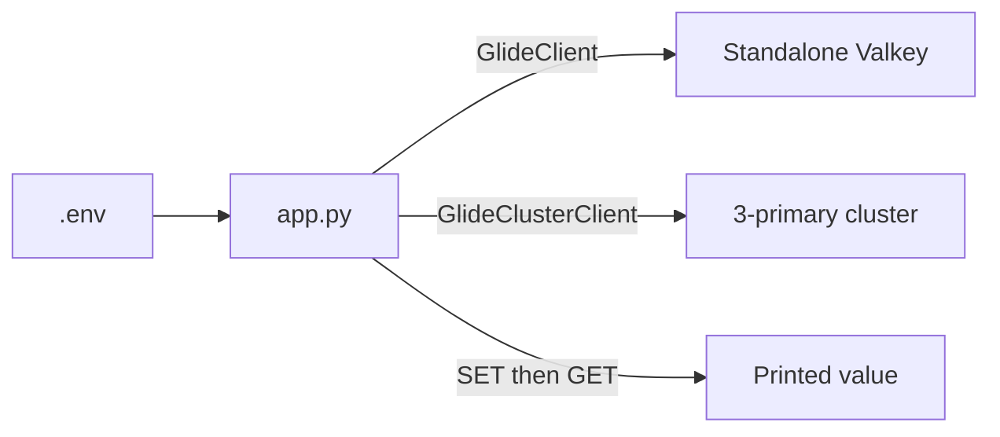

# Minimal Valkey GLIDE Python Connection

## Decision request

Implement `examples/operations/client-connection-glide-python` as a 30-second
demonstration of connecting Python to either standalone Valkey or Valkey
Cluster with GLIDE, storing one string, and retrieving it.

The demo is approved for implementation as a candidate capsule. Repository
admission remains blocked by the governance and reviewer requirements in
`MAINTAINERS.md`.

## Learning objective

The viewer opens one `app.py` file and sees the complete path:

1. load `VALKEY_MODE`, `VALKEY_ADDRESSES`, and `VALKEY_MESSAGE` from `.env`;
2. create `GlideClient` or `GlideClusterClient`;
3. run `SET` and `GET`;
4. print the decoded value; and
5. close the client.

The same file runs against one standalone node or a three-primary Valkey
Cluster.

## Scope

The capsule will:

- use Python 3.14, uv, python-dotenv, and synchronous Valkey GLIDE;
- keep all application behavior in one `app.py`;
- trust `.env` and let missing or malformed configuration fail naturally;
- use one standalone Valkey node;
- use the minimum three-primary cluster with no replicas;
- store one known demo key; and
- provide the standard capsule lifecycle and real-topology verification.

The capsule will not use Flask, Pydantic, Sentinel, OpenTelemetry, a settings
class, a repository layer, custom exceptions, or health endpoints.

## Capsule path

The implementation path is exactly:

```text
examples/operations/client-connection-glide-python
```

The planned tree is:

```text
examples/operations/client-connection-glide-python/
├── compose.yaml
├── docs/
│   ├── DEMO.md
│   ├── DESIGN.md
│   └── TUTORIAL.md
├── example.yaml
├── Makefile
├── README.md
├── pyproject.toml
├── scripts/
├── src/
│   └── valkey_connection/
│       └── app.py
├── tests/
└── uv.lock
```

## Architecture

The application selects only the GLIDE constructor. The `SET` and `GET` calls
stay next to `main()` so the entire teaching path fits on one screen.



## Runtime and verification

The capsule implements `make setup`, `make start`, `make demo`, `make verify`,
`make reset`, and `make stop`.

`VALKEY_MODE=standalone` in `.env` selects the standalone Compose profile.
Changing the mode and addresses to the documented cluster values selects the
cluster profile.

Unit tests exercise the visible application behavior and client selection.
Real integration checks run the same `app.py` command against both topologies.

## Security and production limitations

- Valkey stays on the private Compose network.
- Local nodes use no authentication or TLS.
- Configuration is deliberately trusted.
- The cluster has no replicas and provides no failover.
- The example is not a production deployment reference.

## Acceptance criteria

- The proposal and capsule use
  `examples/operations/client-connection-glide-python`.
- Application behavior fits in one `app.py`.
- `.env` contains every value needed to create the GLIDE client.
- The visible path is client creation, `SET`, `GET`, print, and close.
- Standalone and cluster real-topology checks pass.
- All required lifecycle commands pass.
