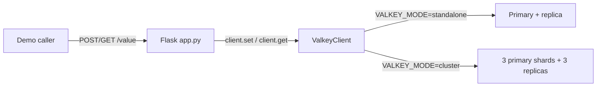

# Valkey GLIDE Flask Client Quickstart

## Decision request

Implement `examples/operations/client-quickstart-python-flask` as a focused
60-second demonstration of creating a synchronous Valkey GLIDE client in
Flask, storing one value, and retrieving it.

The demo is approved for implementation as a candidate capsule. Repository
admission remains blocked by the governance and reviewer requirements in
`MAINTAINERS.md`.

## Learning objective

The reader opens `app.py`, creates one `ValkeyClient`, and sees normal GLIDE
`SET`, `GET`, and `DEL` calls without a configuration framework or application
service layer.

The same application runs against:

- standalone Valkey with one primary and one replica; and
- Valkey Cluster with three primary shards and one replica per shard.

The observable result is a value written through `POST /value` and returned by
`GET /value`.

## Scope

The capsule will:

- use Python 3.14, uv, Flask, Waitress, python-dotenv, and synchronous Valkey
  GLIDE;
- trust `VALKEY_MODE` and `VALKEY_ADDRESSES` from the environment;
- let missing or malformed configuration fail naturally;
- put topology selection in one small `ValkeyClient` class;
- keep `SET`, `GET`, and `DEL` visible in `app.py`;
- provide standalone and cluster Compose profiles;
- use no Sentinel, Pydantic, OpenTelemetry, custom error mapping, or health
  endpoints; and
- delete only the known demo key during reset.

This capsule intentionally favors a short teaching path over the validation,
diagnostics, and recovery behavior required by a production application.

## Capsule path

The implementation path is exactly:

```text
examples/operations/client-quickstart-python-flask
```

The planned source is deliberately small:

```text
examples/operations/client-quickstart-python-flask/
├── compose.yaml
├── example.yaml
├── Makefile
├── README.md
├── pyproject.toml
├── scripts/
├── src/
│   └── valkey_quickstart/
│       ├── app.py
│       └── valkey_client.py
├── tests/
└── uv.lock
```

## Architecture

`ValkeyClient` is the only application class. It translates the two trusted
environment variables into either a standalone or cluster GLIDE client. Flask
uses the resulting public `client` attribute directly.



There is no additional store interface because the quickstart has one caller
and its purpose is to show the GLIDE calls.

## Runtime and verification

The capsule implements `make setup`, `make start`, `make verify`,
`make reset`, and `make stop`. `TOPOLOGY=standalone` is the default;
`TOPOLOGY=cluster` selects the cluster profile.

Unit tests cover route behavior and topology selection. Real integration and
HTTP journey tests execute against both supported topologies.

## Security and production limitations

- Only Flask is published, on loopback.
- Local Valkey nodes use no authentication or TLS.
- Input and environment validation are intentionally minimal.
- Exceptions are intentionally not translated into stable production
  responses.
- The demo is not a production deployment reference.

## Acceptance criteria

- The proposal and capsule both use
  `examples/operations/client-quickstart-python-flask`.
- `app.py` visibly creates a `ValkeyClient` and uses its GLIDE client for
  `SET`, `GET`, and `DEL`.
- No Sentinel implementation or health endpoint exists.
- Standalone runs one primary and one replica.
- Cluster runs three primaries and three replicas.
- All capsule lifecycle commands and both real-topology journeys pass.
