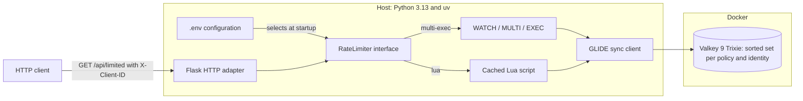
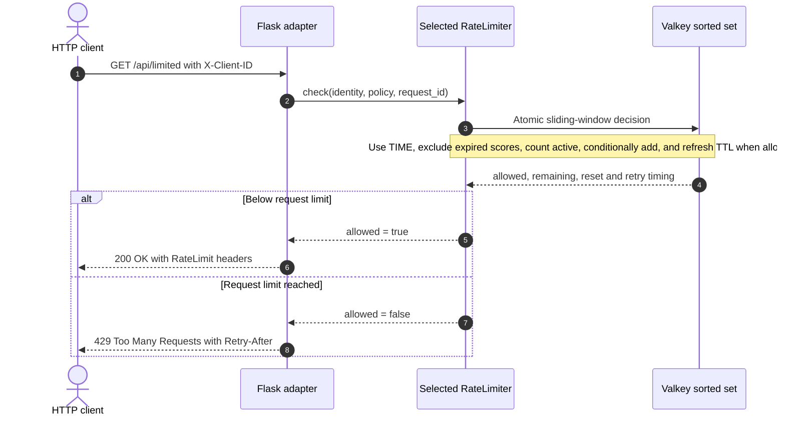

# Design Proposal: Sliding-Window Rate Limiter

## Decision

Implement a focused Python demo that uses Flask, Valkey GLIDE, and a Valkey sorted
set to enforce a sliding-window request limit through two selectable atomic
implementations: `WATCH`/`MULTI`/`EXEC` and server-side Lua.

Implementation is not yet authorized. This proposal remains in `Draft` until
maintainer and backup ownership, runtime CI, security scanning, and clean-clone
reproduction are complete.

## Summary

The proposed demo exposes one rate-limited HTTP endpoint. A caller supplies a
demonstration client identifier, sends requests, and observes:

1. requests within the configured limit return HTTP 200;
2. response metadata shows the limit, remaining capacity, and reset time;
3. the first request above the limit returns HTTP 429;
4. the response includes a bounded retry time; and
5. the caller is admitted again after the oldest request leaves the rolling
   window.

Valkey stores one sorted set per policy and client identity. Each accepted
request is a unique member scored with Valkey server time in milliseconds. The
same rate-limiter interface can be backed by either an optimistic
`WATCH`/`MULTI`/`EXEC` transaction or a server-side Lua script. A local `.env`
toggle selects the implementation, with `multi-exec` as the default.

## Why this belongs in Valkey Examples

The proposal passes the repository placement test:

- its primary purpose is to make Valkey sorted-set behavior observable;
- it is a focused demo with one learning objective;
- the default path uses released public dependencies;
- Valkey runs locally without credentials;
- CI can execute the complete journey against real Valkey;
- the capsule can be independently tested, copied, deprecated, or removed; and
- it requires no independent release or security-advisory lifecycle.

The proposed capability is `rate-limiter` because rate limiting is the
developer's primary learning goal. Sorted sets, scores, cardinality, range
removal, and expiration are the Valkey mechanisms taught by the implementation.

## Goals

The demo must:

- teach a true sliding-window log algorithm rather than a fixed-window counter;
- use a Valkey sorted set as the source of truth;
- provide equivalent `multi-exec` and `lua` implementations;
- select the implementation through `.env`, defaulting to `multi-exec`;
- make each implementation's concurrency guarantee explicit and test it;
- use Valkey server time to avoid application-host clock skew;
- use Python 3.13 or newer, with Python 3.13 as the initial tested baseline;
- use uv for Python acquisition, locking, installation, and command execution;
- use Flask as a small HTTP adapter;
- use the synchronous Valkey GLIDE Python client;
- run Valkey from `valkey/valkey:9-trixie` with an immutable digest;
- remain credential-free and runnable from a clean clone;
- provide a one-command, self-cleaning `make demo` journey after prerequisites
  are installed;
- provide an optional reproducible VHS recording of the same journey;
- reach the first visible rate-limit decision within five minutes; and
- expose all behavior through the capsule's standard `make` interface.

## Non-goals

The first version will not:

- provide production authentication or authorization;
- trust `X-Forwarded-For` or configure a reverse proxy;
- implement distributed policy administration;
- provide per-route configuration through a database or user interface;
- compare rate-limiting algorithms, benchmark the two implementations, or
  publish performance claims;
- use Valkey Cluster, Sentinel, replicas, TLS, or ACLs;
- package a reusable Flask extension or Python library;
- containerize the Flask application in the first version;
- require Homebrew or presentation tools on non-macOS systems;
- commit generated GIF, MP4, WebM, or terminal-frame artifacts; or
- claim that the example is a production-certified rate limiter.

## Implemented capsule

```text
examples/rate-limiter/sliding-window-python-flask/
├── example.yaml
├── README.md
├── DESIGN.md
├── Makefile
├── Brewfile
├── compose.yaml
├── .env.example
├── .gitignore
├── .python-version
├── pyproject.toml
├── uv.lock
├── demo/
│   └── sliding-window.tape
├── scripts/
│   ├── common.sh
│   ├── demo.sh
│   ├── doctor.sh
│   ├── reset.sh
│   ├── start.sh
│   ├── stop.sh
│   ├── test-real.sh
│   └── wait_for_http.py
├── src/
│   └── rate_limiter_demo/
│       ├── __init__.py
│       ├── app.py
│       ├── config.py
│       ├── decision.py
│       ├── identity.py
│       ├── limiter.py
│       └── valkey/
│           ├── __init__.py
│           ├── common.py
│           ├── lua.py
│           ├── multi_exec.py
│           └── scripts/
│               └── sliding_window.lua
└── tests/
    ├── unit/
    ├── integration/
    └── journey/
```

The capsule includes a reader-focused `DESIGN.md` derived from this proposal.

Directories will be added only when they contain required files. No shared
repository runtime package will be introduced.

## Quick demo experience

The shortest macOS path from the capsule directory is:

```shell
brew bundle
make demo
```

Homebrew is a convenience for installing local tools; it is not a runtime
requirement or the only supported installation method. Docker must already be
installed, running, and provide Compose v2 because installing or launching a
container engine is outside the capsule's scope.

The capsule documents three prerequisite tiers:

| Tier | Tools | Purpose |
| --- | --- | --- |
| Core | `make`, Docker with Compose v2, `uv`, HTTPie | Install, start, run, demonstrate, test, and stop the capsule |
| Presentation | `gum`, `bat`, `jq`, `yq` | Improve progress, source display, JSON formatting, and manifest inspection |
| Recording | VHS | Render the scripted terminal journey as MP4 or GIF |

The committed `Brewfile` installs `uv`, `gum`, `httpie`, `bat`, `jq`, `yq`, and
`vhs`. Homebrew's VHS formula also installs its terminal and media dependencies.
The README provides equivalent non-Homebrew installation instructions and
clearly marks VHS as optional.

### Demo command

`make demo` is a non-interactive, deterministic convenience target. It:

1. runs `scripts/doctor.sh` and reports the active tool versions;
2. installs the locked Python environment through `make setup`;
3. starts Valkey and Flask and waits on health checks;
4. reports the selected `multi-exec` or `lua` implementation;
5. displays the selected implementation source and relevant manifest metadata;
6. uses HTTPie to send five allowed requests for identity A and format their
   status, headers, and JSON;
7. uses HTTPie to send identity A's sixth request and highlight HTTP 429 and
   `Retry-After`;
8. sends a request for identity B and observes HTTP 200, proving isolation;
9. displays the bounded sorted-set state without exposing either raw identity;
10. follows server-provided retry intervals through bounded polling and
    demonstrates identity A's next allowed request; and
11. calls `make stop` from an exit trap, including after interruption or
    partial failure.

HTTPie is required for `make demo`. Every user-visible HTTP request uses the
`http` command; the demo has no curl fallback. `scripts/doctor.sh` fails fast
with platform-appropriate HTTPie installation guidance when `http` is missing.

The command uses Gum, bat, jq, and yq when available and falls back to plain
output when those presentation tools are absent. Missing optional tools produce
a single installation hint, not a failure. `CI=1 make demo` still uses HTTPie
but disables color, animation, prompts, and timing-dependent pauses for stable
output.

The default command demonstrates `multi-exec`. The alternate implementation
requires no file edit:

```shell
RATE_LIMIT_IMPLEMENTATION=lua make demo
```

Both invocations exercise the same journey and assertions. `make demo` manages
only resources labeled for this capsule and must not stop unrelated processes
or containers.

### Demo recording

`make demo-record` validates and runs `demo/sliding-window.tape`. The tape types
the same `make demo` command a reader runs; it does not duplicate the HTTP
scenario in VHS instructions.

The default output is:

```text
.artifacts/sliding-window-rate-limiter.mp4
```

`.artifacts/` is ignored and generated media is never required for runtime,
tests, or review. The tape uses health-based readiness and the deterministic
demo command rather than fixed sleeps for application startup. Recording is an
explicit local action and is not part of the default CI or clean-clone journey.

## Runtime topology

The architecture keeps the HTTP adapter independent from the selected atomic
rate-limiter implementation:



Only Valkey runs in Docker in the default journey. The Flask process runs on
the host through uv. Configuration chooses one adapter during application
startup, while both adapters reach the same Valkey sorted-set representation
through the synchronous GLIDE client.

This separation is intentional: the checked-out GLIDE Python project supports
Python 3.13 and provides a synchronous package, but explicitly does not support
Alpine Linux or other musl-based Python environments. That limitation applies
to the host-run Flask process where GLIDE is loaded, not to the separate Valkey
server container. The server nevertheless uses the requested Debian Trixie
image for a consistent glibc-based container choice. A future containerized
Flask adapter must also use a compatible glibc-based Python image.

## Module design

### Flask HTTP adapter

The Flask module owns:

- request parsing and input validation;
- mapping a decision to JSON, response headers, and HTTP status;
- liveness and readiness endpoints; and
- mapping dependency failures to HTTP 503.

It does not know sorted-set commands, Lua return positions, key formats, or
GLIDE result encodings.

The application will use a Flask application factory. The rate limiter is
accepted as a dependency rather than created inside route handlers.

### RateLimiter interface

The external seam is one operation:

`check(identity, policy, request_id) -> decision`

The interface includes these invariants:

- one call represents one attempted request;
- the returned decision contains `allowed`, `limit`, `remaining`,
  `reset_after_ms`, and `retry_after_ms`;
- `remaining` is never negative;
- `retry_after_ms` is zero for an allowed request;
- a dependency failure is an error, not a deny decision; and
- callers do not depend on Valkey, GLIDE, Lua, or sorted-set result types.

The small interface gives the HTTP adapter one test surface while keeping
atomicity, key construction, transaction or script execution, and result
decoding local to the selected Valkey implementation.

### Valkey adapters

Both Valkey adapters own:

- deriving a bounded, non-sensitive key;
- applying identical window-boundary and decision semantics;
- validating and decoding Valkey results;
- translating GLIDE failures into a dependency error; and
- closing the GLIDE client during application shutdown.

`MultiExecValkeySlidingWindow` implements the operation with optimistic locking
and an atomic batch. `LuaValkeySlidingWindow` implements it with one cached
server-side script. Configuration selects one adapter at application startup;
route handlers never branch on the implementation.

The Lua adapter retains one GLIDE `Script` object and uses one process-lifetime
GLIDE client. The multi-exec adapter also owns a process-lifetime client, but it
must guard the complete `WATCH` through `EXEC` sequence with a process-local
mutex so two threads cannot interleave transaction state on the same client.
Separate processes create their clients after forking and coordinate through
Valkey's optimistic locking.

Application teardown must not close a shared client after every request.

### Identity adapter

The demo endpoint requires an `X-Client-ID` header so the scripted journey can
select identities deterministically.

The raw identifier:

- is limited to a documented maximum length;
- is never embedded directly in a Valkey key;
- is hashed before storage;
- is never written to logs; and
- is explicitly described as demonstration input, not authentication.

The default design does not trust proxy headers. A production application
would normally derive identity from an authenticated subject or an explicitly
trusted proxy configuration.

## Sliding-window algorithm

### Key

Each policy and identity uses one key:

`valkey-examples:rate-limit:v1:<policy-id>:<identity-hash>`

Each operation uses only one key, so both implementations remain cluster-slot
safe if cluster support is added later.

### Sorted-set representation

- The score is Valkey server time in Unix milliseconds.
- The member is the timestamp plus an application-generated unique request ID.
- Multiple requests in the same millisecond remain distinct members.
- The sorted-set cardinality is bounded by the configured request limit because
  denied requests are not inserted.

Unix time in milliseconds remains within the exactly representable integer
range documented for sorted-set scores.

### Shared decision semantics

For one attempted request, both implementations:

1. validates the limit and window arguments;
2. obtains the current time from Valkey with `TIME`;
3. computes the inclusive expiration cutoff;
4. treats scores at or before the cutoff as expired;
5. counts only scores greater than the cutoff;
6. allows the request only when the count is below the configured limit;
7. for an allowed request, adds one unique member with `ZADD`;
8. removes expired members with `ZREMRANGEBYSCORE` and refreshes the key
   expiration with `PEXPIRE`;
9. reads the oldest active score needed to calculate reset time; and
10. returns the same decision and timing values.

The adapter interface is the atomicity seam. The design rejects a sequence of
independent client commands because concurrent Flask workers could otherwise
admit more requests than the policy permits.

The Lua implementation may clean expired members before deciding. The
multi-exec deny path may leave them for the next accepted request or key
expiration. This storage-maintenance difference must not change the observable
decision.

An entry whose timestamp is exactly one full window old is expired. This rule
must be stated in tests so boundary behavior is not implementation-dependent.

### Multi-exec execution

`multi-exec` is the default implementation. It uses optimistic locking because
plain `MULTI`/`EXEC` cannot conditionally insert a member based on a queued
`ZCOUNT` result.

Within the process-local transaction mutex, one attempt:

1. calls `WATCH` for the rate-limit key;
2. calls `TIME` and calculates the cutoff;
3. counts active scores greater than the cutoff with `ZCOUNT`;
4. creates `Batch(is_atomic=True)`;
5. when capacity is available, queues cleanup, insertion, expiration, and an
   oldest-score read;
6. when the limit is already reached, queues read-only count and oldest-score
   commands to verify the watched state;
7. calls `exec`; and
8. retries the complete attempt with a new server timestamp when `exec` returns
   `None` because the watched key changed.

The deny path does not extend the key lifetime. Expired entries may remain
until the next accepted request, but active counting excludes them and the key
still expires after the last accepted request's window.

Retries are bounded. Exhausting the retry budget is a dependency error rather
than an implicit allow or deny decision. Every exception path must clear watch
state before returning the client to use.

### Lua execution

The synchronous GLIDE `Script` interface is used because it:

- retains script code and its hash;
- automatically uses cached script execution;
- accepts explicit key and argument arrays;
- routes a keyed invocation correctly; and
- avoids wrapping the operation in a second transaction layer.

The script object is created once and retained for the process lifetime.
The script performs validation, server-time lookup, cleanup, counting,
conditional insertion, expiration, and oldest-score lookup in one atomic
server-side execution.

## HTTP interface

### `GET /api/limited`

Required request header:

`X-Client-ID: <demonstration identity>`

Allowed response:

- status: `200 OK`;
- JSON fields: `allowed`, `limit`, `remaining`, `reset_after_ms`; and
- headers: `RateLimit-Limit`, `RateLimit-Remaining`, and `RateLimit-Reset`.

Denied response:

- status: `429 Too Many Requests`;
- JSON fields: `allowed`, `limit`, `remaining`, `reset_after_ms`, and
  `retry_after_ms`; and
- headers: the rate-limit fields plus `Retry-After`.

`Retry-After` is rounded up to whole seconds. JSON retains millisecond precision
so the behavior is easy to inspect.

Missing or invalid identity input returns HTTP 400 and does not call Valkey.

### Allowed and denied request sequence

The selected adapter returns the same decision contract whether it uses
`WATCH`/`MULTI`/`EXEC` or Lua:



An allowed decision records the unique request member and returns HTTP 200. A
denied decision does not insert a member and returns HTTP 429 with the bounded
retry interval. Flask maps the decision to HTTP without knowing which Valkey
adapter produced it.

### `GET /health/live`

Returns HTTP 200 when the Flask process is running. It does not query Valkey.

### `GET /health/ready`

Returns HTTP 200 only when the GLIDE client can reach Valkey. Dependency
failures return HTTP 503.

## Configuration

The default demonstration policy is proposed as five requests per ten-second
sliding window.

Configuration will be provided through environment variables:

The application maps and validates these values through one immutable
`pydantic-settings` model. Process environment values take precedence over the
optional local `.env` file.

| Setting | Default | Constraint |
| --- | --- | --- |
| `VALKEY_HOST` | `127.0.0.1` | Non-empty hostname |
| `VALKEY_PORT` | `6379` | Valid TCP port |
| `GLIDE_REQUEST_TIMEOUT_MS` | `500` | Positive and bounded |
| `RATE_LIMIT_IMPLEMENTATION` | `multi-exec` | `multi-exec` or `lua` |
| `RATE_LIMIT_MAX_RETRIES` | `50` | Positive and bounded |
| `RATE_LIMIT_REQUESTS` | `5` | Positive and bounded |
| `RATE_LIMIT_WINDOW_MS` | `10000` | Positive and bounded |
| `RATE_LIMIT_POLICY_ID` | `default` | Lower-case bounded slug |
| `RATE_LIMIT_KEY_PREFIX` | `valkey-examples:rate-limit:v1` | Fixed by default |
| `FLASK_HOST` | `127.0.0.1` | Loopback default |
| `FLASK_PORT` | `8000` | Valid TCP port |

The committed `.env.example` sets
`RATE_LIMIT_IMPLEMENTATION=multi-exec`. A local ignored `.env` can switch to
`RATE_LIMIT_IMPLEMENTATION=lua`, and `make start` loads that file when present.
The application-level default remains `multi-exec` when the variable is absent.

Invalid configuration fails application startup rather than falling back to an
unknown policy.

## Dependency and runtime choices

### Python and uv

- `requires-python` declares Python 3.13 as the minimum.
- `.python-version` records the tested Python `3.13.12` patch.
- `uv.lock` is committed.
- setup uses `uv sync --frozen`.
- all Python commands run through `uv run`.

Python versions newer than 3.13 are not added to the tested compatibility
matrix until the selected GLIDE release publishes compatible wheels and CI
passes.

### Flask

Flask `3.1.3` is the synchronous HTTP adapter and is locked in `uv.lock`.

The built-in development server is used only for the local educational journey.
The README will explicitly state that it is not a production server.

### HTTPie

The human-facing demo uses HTTPie's `http` command for every endpoint request
because it presents status lines, headers, and JSON more clearly than a raw HTTP
client. The implementation selects and records an exact tested HTTPie version.
CI installs that version explicitly before running `CI=1 make demo`.

HTTPie is demo tooling, not an application dependency. Flask health polling and
pytest may use their native clients internally, but the documented demo command
does not invoke curl.

### Valkey GLIDE

The capsule uses the `valkey-glide-sync` distribution and the `glide_sync`
import namespace.

The exact released version is `2.5.1` and is recorded in the lockfile.
The multi-exec adapter uses GLIDE's synchronous `watch`, sorted-set commands,
`Batch(is_atomic=True)`, `exec`, and `unwatch` interfaces. The Lua adapter uses
the cached `Script` interface. Direct sorted-set calls may also be used for test
inspection.

### Valkey container

The Compose service uses Valkey 9.1.1 through the requested
`valkey/valkey:9-trixie` image and records the resolved immutable digest:

`valkey/valkey:9-trixie@sha256:70739f85ad2ee01a726a965584a0f94895f01b0c60b3cc8b0aeef11eaa6888cf`

This preserves the requested Valkey 9 Debian Trixie tag while satisfying the
repository's immutable-image requirement.

The service:

- binds port 6379 to loopback only;
- declares a `valkey-cli ping` health check;
- uses ephemeral data for deterministic reset and cleanup;
- requires no credentials on the local path; and
- documents that no authentication and no TLS are unsafe outside local
  development.

## Failure behavior

If Valkey is unavailable, a transaction exhausts its retry budget, a script
fails, or a GLIDE result cannot be validated, the endpoint returns HTTP 503.

The demo does not silently fail open and does not misreport a dependency
failure as HTTP 429. This makes the learning outcome and operational limitation
visible.

Logs include the decision, policy ID, HTTP status, and latency. They do not
include the raw client identity, full derived key, transaction arguments, or
script arguments. Logs identify the selected implementation and may record
aggregate transaction retry counts.

## Test strategy

### Unit tests

Unit tests cover:

- configuration validation;
- implementation selection and invalid toggle values;
- identity normalization, bounds, and hashing;
- key construction;
- multi-exec and script result decoding and invariant checks;
- bounded transaction retry and watch cleanup behavior;
- HTTP response and header mapping;
- missing and invalid identity behavior; and
- dependency-error mapping to HTTP 503.

The HTTP adapter uses a fake `RateLimiter` implementation. Tests do not reach
past the interface to assert GLIDE internals.

### Integration tests

The shared contract suite runs once with `multi-exec` and once with `lua`
against the requested real Valkey container and verifies:

- requests up to the limit are allowed;
- the next request is denied;
- exactly the configured number of concurrent requests are allowed;
- denied requests do not increase sorted-set cardinality;
- entries at the window cutoff are removed;
- same-millisecond requests remain distinct;
- reset and retry times are positive and bounded;
- key expiration is set and refreshed;
- keys disappear after the inactivity window; and
- GLIDE reconnect and dependency failures produce defined errors.

The multi-exec concurrency test uses multiple independent adapter/client
instances so real `WATCH` conflicts occur; it asserts bounded retries and that
no more than the configured limit is admitted. A separate same-client test
proves the process-local mutex prevents overlapping watch sequences. The Lua
concurrency test invokes the cached script from multiple threads and asserts
the same admission bound.

An equivalence test feeds both adapters the same scenarios and asserts the same
allow/deny, remaining-capacity, cutoff, reset, and retry semantics without
requiring identical internal command traces.

### Journey test

The documented default journey, driven by `make demo`:

1. starts Valkey and waits for health;
2. starts Flask with `RATE_LIMIT_IMPLEMENTATION=multi-exec`;
3. sends five requests for `demo-user-a` and observes HTTP 200;
4. sends identity A's sixth request and observes HTTP 429;
5. sends a request for `demo-user-b` and observes HTTP 200;
6. verifies rate-limit, retry, and isolated sorted-set state;
7. follows server-provided retry intervals through bounded polling;
8. sends another identity A request and observes HTTP 200; and
9. stops Flask and removes the Valkey container and generated state.

The journey is then repeated with `RATE_LIMIT_IMPLEMENTATION=lua`. Documentation
shows the one-line `.env` change and the application reports the selected
implementation at startup.

The default journey must complete within five minutes. CI uses a shorter
test-only window while exercising both real implementations and Valkey
server-time paths.

The journey test asserts the plain `CI=1 make demo` path. Presentation rendering
and VHS encoding are kept outside behavioral assertions, while the tape is
validated statically.

## Capsule interface

The future implementation must provide:

| Command | Responsibility |
| --- | --- |
| `make doctor` | Report required and optional tool availability without changing the host |
| `make setup` | Install the pinned Python runtime and locked dependencies through uv |
| `make start` | Start Valkey, wait for health, then start Flask |
| `make demo` | Run the visible rate-limit journey and always clean up capsule-owned resources |
| `make demo-record` | Validate the VHS tape and render the same journey to ignored media artifacts |
| `make verify` | Run formatting, linting, type checking, unit, integration, and journey tests |
| `make reset` | Remove rate-limit keys and restore deterministic demo state |
| `make stop` | Stop processes and remove containers and generated state |

`make stop` must remain safe after partial startup. Convenience targets extend
the repository's required capsule interface; they do not replace its standard
setup, start, verify, reset, and stop commands.

## Static quality gates

The implementation must run:

- Ruff formatting checks;
- Ruff lint checks;
- a configured static type checker;
- pytest unit, integration, and journey suites;
- shell lint for demo orchestration;
- static validation of the VHS tape;
- manifest and lockfile validation;
- container and dependency scans; and
- Markdown and link checks.

All checks use pinned dependencies and run through uv where applicable.

## Security considerations

- `X-Client-ID` is untrusted demonstration input, not authentication.
- The value is bounded and hashed before key construction.
- Proxy headers are not trusted by default.
- Valkey and Flask bind to loopback.
- No credentials, tokens, or generated secrets are committed.
- Local no-auth and no-TLS behavior carries a production warning.
- Limit and window inputs are configuration, not request parameters.
- Both adapters validate numeric arguments before changing state.
- Multi-exec retries are bounded to prevent unbounded request work under
  contention.
- User input cannot select arbitrary keys or commands.
- The development server is not presented as production-ready.
- The design avoids publishing performance or denial-of-service resistance
  claims.

## Resource budget

Proposed clean-clone baseline:

- 2 CPU cores;
- 2 GiB RAM;
- 2 GiB free disk;
- no paid services or credentials; and
- less than five minutes to the first complete journey.

Download size and actual peak usage must be measured during implementation and
recorded in `example.yaml`.

The runtime budget excludes optional Homebrew and VHS installation. The README
must separately report the measured download, disk, and render-time cost of the
full `brew bundle` and `make demo-record` authoring path.

## Acceptance criteria

Implementation may enter review only when:

- the capsule follows the proposed path and contains no unrelated scaffolding;
- Python 3.13 is the tested baseline and uv owns dependency execution;
- Flask uses a process-lifetime GLIDE sync client;
- Valkey runs from `valkey/valkey:9-trixie` pinned to an immutable digest;
- `.env.example` defaults to `RATE_LIMIT_IMPLEMENTATION=multi-exec`;
- `brew bundle` installs the documented macOS demo and recording tools;
- `make doctor` distinguishes core, presentation, and recording dependencies;
- `make demo` completes the visible journey and cleans up after success,
  failure, or interruption;
- every user-visible demo request uses HTTPie and no curl fallback exists;
- `CI=1 make demo` provides deterministic plain output suitable for CI;
- `make demo-record` validates the tape and produces an ignored MP4 from the
  same demo command;
- `multi-exec` uses `WATCH` plus a bounded-retry atomic batch;
- `lua` uses one atomic cached sorted-set script;
- both implementations satisfy the same behavioral contract;
- five requests are allowed and the sixth is denied under the default policy;
- real concurrent tests prove that neither implementation admits more than the
  configured limit;
- the key expires after the rolling window;
- all response fields and failure modes are documented and tested;
- the complete journey succeeds from a clean clone;
- `make stop` leaves no running process, container, volume, or generated state;
- required security and compatibility gates pass; and
- primary and backup owners and reviewers are recorded.

## Alternatives considered

### Fixed-window counter

Rejected because it allows bursts across window boundaries and does not teach
the requested sliding-window sorted-set pattern.

### Multiple independent sorted-set commands

Rejected because concurrent workers can interleave removal, counting, and
insertion and admit too many requests.

### Plain multi-exec without watch

Rejected because results from commands queued after `MULTI` are not available
until `EXEC`, so the application cannot safely decide whether to queue `ZADD`.
The accepted transaction implementation adds `WATCH`, pre-transaction reads,
and bounded retries.

### Only one atomic implementation

Rejected because the requested example should teach both the client-side
optimistic transaction and server-side scripting approaches behind the same
small interface. The proposal does not claim that one is universally faster or
more production-ready.

### Token bucket

Rejected because it teaches a different algorithm and does not satisfy the
sorted-set requirement.

### Async GLIDE inside Flask routes

Rejected because Flask is a synchronous WSGI adapter for this demo. The sync
GLIDE package avoids per-request event-loop management and keeps the interface
smaller.

### Alpine-based containers

Rejected for this example. GLIDE's documented Alpine/musl limitation applies
to the Python environment, not to the separate Valkey server process. The
example still standardizes on the requested Debian Trixie server image to avoid
mixed base-image guidance, and any future Flask image must be glibc-based.

## Remaining promotion decisions

The following values must be recorded before promotion from `candidate`:

1. primary and backup content owners;
2. primary and backup Python reviewers;
3. whether the initial compatibility matrix includes only standalone Valkey;
   and
4. the reviewer responsible for the clean-clone reproduction.

## Primary-source basis

- [Valkey GLIDE Python client overview](https://github.com/valkey-io/valkey-glide/blob/main/python/README.md)
- [Valkey GLIDE synchronous command interface](https://github.com/valkey-io/valkey-glide/blob/main/python/glide-sync/glide_sync/sync_commands/core.py)
- [Valkey GLIDE synchronous transaction interface](https://github.com/valkey-io/valkey-glide/blob/main/python/glide-sync/glide_sync/sync_commands/standalone_commands.py)
- [Valkey GLIDE synchronous Lua script guide](https://github.com/valkey-io/valkey-glide/blob/main/docs/markdown/python/sync/lua-scripts-guide.md)
- [Valkey transaction documentation](https://valkey.io/topics/transactions/)
- [Valkey `WATCH` documentation](https://valkey.io/commands/watch/)
- [Valkey sorted-set `ZADD` documentation](https://valkey.io/commands/zadd/)
- [Valkey `ZCARD` documentation](https://valkey.io/commands/zcard/)
- [Valkey `ZCOUNT` documentation](https://valkey.io/commands/zcount/)
- [Valkey `ZREMRANGEBYSCORE` documentation](https://valkey.io/commands/zremrangebyscore/)
- [Valkey `TIME` documentation](https://valkey.io/commands/time/)
- [Valkey `PEXPIRE` documentation](https://valkey.io/commands/pexpire/)
- [Homebrew Bundle and Brewfile documentation](https://docs.brew.sh/Brew-Bundle-and-Brewfile)
- [Gum repository](https://github.com/charmbracelet/gum)
- [VHS repository](https://github.com/charmbracelet/vhs)
