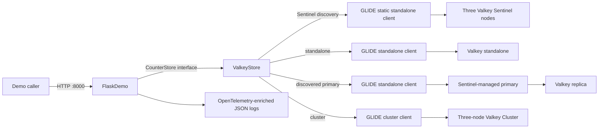
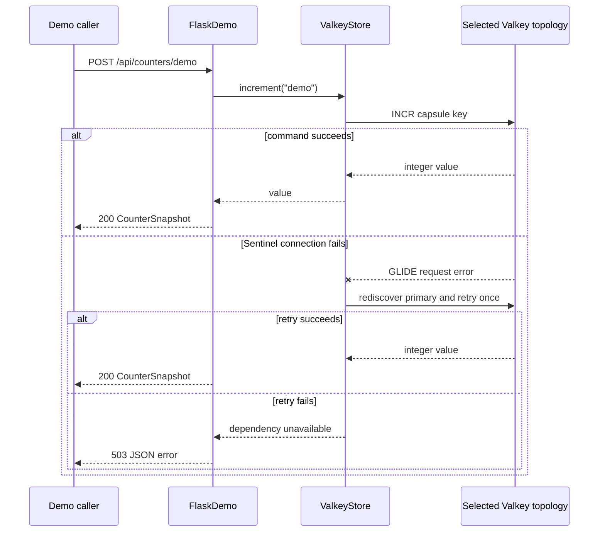

# Topology-Aware Flask Application with Python and GLIDE

## Decision request

Implement `examples/operations/topology-aware-python-flask` as a reusable demo
foundation for synchronous Flask applications that connect to Valkey in one of
three local topologies:

- standalone;
- Sentinel-managed primary and replica; or
- Valkey Cluster.

The demo is approved for implementation as a candidate capsule. Repository
admission remains blocked by the governance and reviewer requirements in
`MAINTAINERS.md`.

## Learning objective

The user starts the same Flask application with a topology setting, exercises a
counter through HTTP, and observes that the application selects the correct
Valkey GLIDE client and connection workflow without changing route code.

The observable result is:

1. `GET /api/topology` reports the selected topology;
2. `POST /api/counters/demo` increments a Valkey-backed counter;
3. the same journey passes against standalone, Sentinel, and cluster; and
4. structured logs contain OpenTelemetry trace context.

Valkey is material because the topology determines discovery, routing,
connection recovery, and key access behavior.

## Scope

The capsule will:

- use Python 3.14, uv, Flask, Waitress, Pydantic Settings, and synchronous
  Valkey GLIDE;
- expose an application factory with dependency injection for tests and future
  demos;
- validate environment configuration before opening network connections;
- hide topology-specific behavior behind one counter-store interface;
- use GLIDE's standalone client for standalone deployments;
- query Sentinel with a static GLIDE standalone connection, then connect a
  second GLIDE standalone client to the discovered primary;
- use GLIDE's cluster client for Valkey Cluster;
- retry Sentinel discovery once after a GLIDE request or connection failure;
- emit JSON logs enriched with OpenTelemetry trace identifiers;
- optionally export traces and logs to an OTLP HTTP endpoint;
- run the same integration and HTTP journey against all three topologies; and
- remove only the capsule's known demo counter during reset.

The first version will not:

- present the Flask application as a reusable framework extension or released
  library;
- provide production TLS certificates, ACL provisioning, or secret management;
- claim native GLIDE Sentinel support;
- run a destructive keyspace-wide cleanup command;
- benchmark or compare topology performance; or
- prove zero-downtime Sentinel failover under production traffic.

## Capsule path

The implementation path is exactly:

```text
examples/operations/topology-aware-python-flask
```

The planned tree is:

```text
examples/operations/topology-aware-python-flask/
├── .dockerignore
├── .env.example
├── .gitignore
├── .python-version
├── DESIGN.md
├── Dockerfile
├── Makefile
├── README.md
├── compose.yaml
├── example.yaml
├── infra/
│   └── sentinel/
│       └── sentinel.conf
├── pyproject.toml
├── scripts/
│   ├── common.sh
│   ├── demo.py
│   ├── reset.py
│   ├── start.sh
│   ├── stop.sh
│   ├── test-real.sh
│   └── wait_for_http.py
├── src/
│   └── valkey_flask_demo/
│       ├── __init__.py
│       ├── app.py
│       ├── config.py
│       ├── models.py
│       ├── py.typed
│       ├── store.py
│       └── telemetry.py
├── tests/
│   ├── integration/
│   │   └── test_store.py
│   ├── journey/
│   │   └── test_http_journey.py
│   └── unit/
│       ├── test_app.py
│       ├── test_config.py
│       └── test_store.py
└── uv.lock
```

## Architecture

The route layer learns one store interface. `ValkeyStore` contains the
topology-specific implementation and owns the process-lifetime GLIDE client.



The Sentinel adapter is explicit because the selected GLIDE release does not
expose a native Sentinel client. It sends
`SENTINEL GET-MASTER-ADDR-BY-NAME` through a short-lived static GLIDE
standalone client, validates the response, and then creates the normal data
client.

## Request flow



Standalone and cluster clients rely on GLIDE's own routing and reconnection.
Only Sentinel requires application-owned rediscovery.

## Configuration

`AppSettings` is an immutable Pydantic Settings model. Important variables are:

| Variable | Purpose |
| --- | --- |
| `VALKEY_TOPOLOGY` | `standalone`, `sentinel`, or `cluster` |
| `VALKEY_ADDRESSES` | Comma-separated bootstrap addresses |
| `VALKEY_SENTINEL_MASTER` | Sentinel master group name |
| `VALKEY_DATABASE_ID` | Standalone logical database; cluster requires zero |
| `VALKEY_REQUEST_TIMEOUT_MS` | Bounded GLIDE command timeout |
| `VALKEY_CONNECTION_TIMEOUT_MS` | Bounded TCP connection timeout |
| `VALKEY_KEY_PREFIX` | Validated capsule-owned key prefix |
| `OTEL_EXPORTER_OTLP_ENDPOINT` | Optional OTLP HTTP base endpoint |
| `FLASK_HOST` / `FLASK_PORT` | Application bind address and port |

The local Compose journey uses no credentials and no TLS. Those defaults are
explicitly non-production.

## Module design

`ValkeyStore` is the deep module. Its small interface is:

- `get(name)`;
- `increment(name)`;
- `delete(name)`;
- `ping()`;
- `topology_snapshot()`; and
- `close()`.

Callers do not know about GLIDE client classes, Sentinel commands, node
addresses, byte decoding, retries, or cluster routing.

`FlaskDemo` is the HTTP adapter. It owns route registration, Pydantic response
serialization, error mapping, and request logging. The application factory
accepts a store so unit tests and future demos can replace the Valkey adapter
without patching global state.

## Runtime and lifecycle

The stable capsule interface is:

| Command | Behavior |
| --- | --- |
| `make setup` | Install the locked Python environment |
| `make start` | Build and start the selected topology and application |
| `make verify` | Run static, unit, real-Valkey, and HTTP journey checks |
| `make reset` | Delete the known `demo` counter through the application |
| `make stop` | Stop only this Compose project's resources |

`TOPOLOGY=standalone` is the default. `TOPOLOGY=sentinel` and
`TOPOLOGY=cluster` select the other profiles.

## Verification

Unit tests cover:

- configuration parsing and invalid combinations;
- Flask route behavior through a fake store;
- standalone, Sentinel, and cluster client construction; and
- Sentinel response validation and reconnect behavior.

Real-Valkey checks run the same store contract and HTTP journey against every
topology. The journey asserts readiness, topology reporting, counter
increments, deletion, and cleanup.

## Security and production limitations

- Only the Flask port is published, and it binds to loopback.
- Local Valkey processes use no authentication or TLS.
- Containers use a private Compose network.
- Reset deletes one validated capsule key and never uses `FLUSHDB`.
- Logs never include credentials or counter values from arbitrary keys.
- Sentinel discovery is a compact educational adapter, not a replacement for
  a client with first-class Sentinel support and tested failover guarantees.
- Waitress is appropriate for the local synchronous demo but does not define a
  production deployment architecture.

## Acceptance criteria

- The capsule exists at
  `examples/operations/topology-aware-python-flask`.
- All direct dependencies, container tags, and images are pinned.
- `example.yaml` validates against `schemas/example.schema.json`.
- The README contains synchronized architecture and request-flow diagrams.
- `make setup`, `make start`, `make reset`, `make stop`, and `make verify`
  execute successfully.
- Native format, lint, strict type checks, and unit tests pass.
- Integration and HTTP journey tests pass against standalone, Sentinel, and
  cluster.
- Cleanup succeeds after complete and partial startup.
- Repository structure, Markdown, YAML, and `git diff --check` validation pass.
