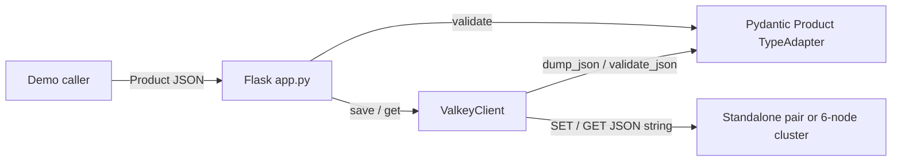
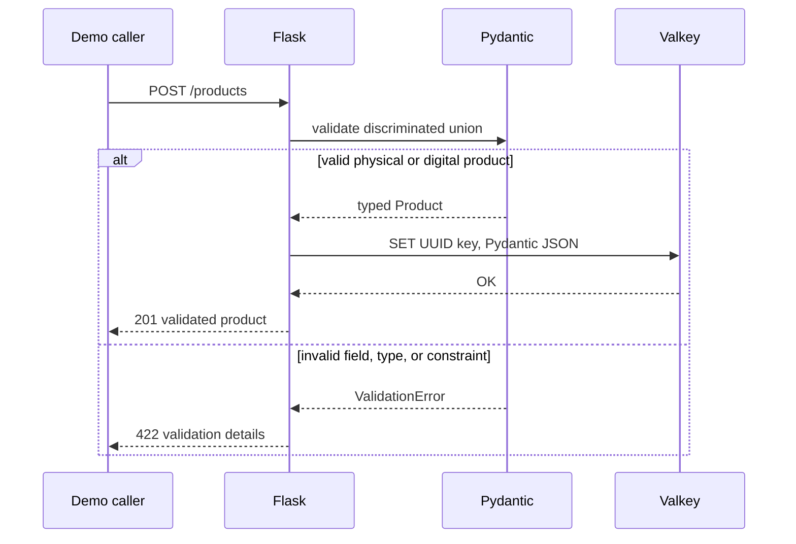

# Validated Object Storage with Pydantic

## Decision request

Implement `examples/data-structures/validated-object-storage-python-flask` as
a focused demonstration of validating typed Python objects with Pydantic,
serializing them into Valkey strings, and reconstructing the correct object
variant on read.

The demo is approved for implementation as a candidate capsule. Repository
admission remains blocked by the governance and reviewer requirements in
`MAINTAINERS.md`.

## Learning objective

The reader sends either a physical or digital product to Flask and observes
three behaviors:

1. Pydantic accepts valid values and rejects invalid types or constraints;
2. the validated object is stored as JSON in a Valkey string; and
3. reading the key returns the correct typed product variant.

The capsule retains the quickstart topology choices:

- standalone Valkey with one primary and one replica; and
- Valkey Cluster with three primary shards and one replica per shard.

## Domain model

A product has a UUID, constrained name, positive decimal price, boolean active
state, bounded tags, and timezone-aware creation time.

A physical product also requires non-negative stock and positive weight. A
digital product requires an HTTP download URL and positive file size. The
`kind` field is the discriminator, and extra fields are rejected.

## Scope

The capsule will:

- use Python 3.14, uv, Flask, Waitress, Pydantic, python-dotenv, and
  synchronous Valkey GLIDE;
- represent physical and digital products as a Pydantic discriminated union;
- use `TypeAdapter` for validation, JSON serialization, and typed
  reconstruction;
- store each product under a bounded UUID-derived key;
- return validation failures as HTTP 422 responses;
- provide standalone and cluster Compose profiles;
- keep configuration environment-driven and intentionally small; and
- delete only the two known demo products during reset.

The capsule will not:

- use Valkey JSON or Valkey Search modules;
- implement secondary indexes, queries, migrations, or schema evolution;
- provide Sentinel support;
- add application health endpoints; or
- present the example as a general object-mapping library.

## Capsule path

The implementation path is exactly:

```text
examples/data-structures/validated-object-storage-python-flask
```

The planned source remains compact:

```text
examples/data-structures/validated-object-storage-python-flask/
├── CONTEXT.md
├── compose.yaml
├── docs/
│   ├── DEMO.md
│   ├── DESIGN.md
│   └── TUTORIAL.md
├── example.yaml
├── Makefile
├── README.md
├── pyproject.toml
├── scripts/
├── src/
│   └── validated_objects/
│       ├── app.py
│       ├── models.py
│       └── valkey_client.py
├── tests/
└── uv.lock
```

## Architecture

Pydantic owns the object contract. `ValkeyClient` is the deep module that owns
connection selection plus typed serialization and reconstruction.



## Request flow



## Runtime and verification

The capsule implements `make setup`, `make start`, `make verify`,
`make reset`, and `make stop`. `TOPOLOGY=standalone` is the default;
`TOPOLOGY=cluster` selects the cluster profile.

Unit tests cover both variants, invalid fields, serialization, typed
reconstruction, and Flask responses. Real integration and HTTP journey tests
execute against both supported topologies and assert their actual shape.

## Security and production limitations

- Only Flask is published, on loopback.
- Local Valkey nodes use no authentication or TLS.
- Stored JSON is trusted after it has been written by the application.
- Keys are derived only from UUID values.
- The demo has no schema migration or compatibility strategy.
- The demo is not a production object persistence framework.

## Acceptance criteria

- Every path reference uses
  `examples/data-structures/validated-object-storage-python-flask`.
- Both physical and digital products round-trip through real Valkey.
- Invalid types, constraints, discriminators, and extra fields are rejected.
- Standalone runs one primary and one replica.
- Cluster runs three primaries and three replicas.
- No Sentinel implementation or application health endpoint exists.
- All capsule lifecycle commands and both real-topology journeys pass.
