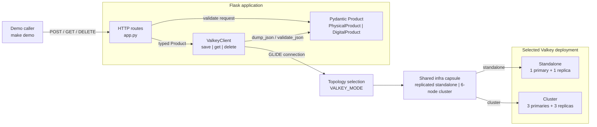
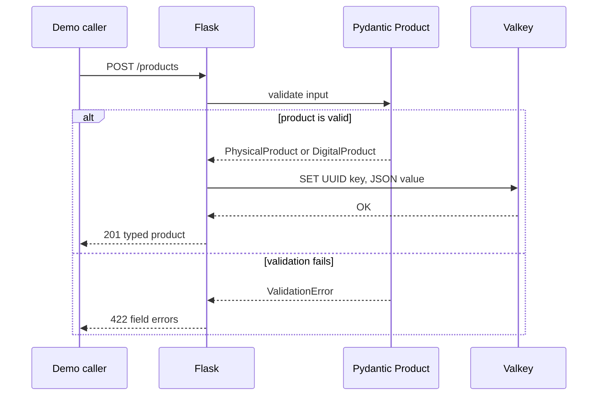

# Validated Object Storage with Pydantic

In this capsule, you extend the
[Valkey GLIDE Flask quickstart](../../operations/client-quickstart-python-flask/)
with typed object validation and serialization. You store physical and digital
products as JSON in ordinary Valkey strings. When you read them, Pydantic
reconstructs the correct product type.

**Level:** [`L200` — Intermediate](../../../docs/authoring.md#choose-the-level)

## Start here

You should know basic Python classes, dictionaries, JSON, and Flask routes.
This capsule adds one idea: check an object before storing it.

The program follows this path:

1. Flask receives product JSON;
2. Pydantic checks every field;
3. Valkey stores valid products as JSON text;
4. reads turn that JSON back into a Python product; and
5. invalid products return HTTP 422 without reaching Valkey.

Key words:

- **validation:** checking that data has the expected type and allowed value;
- **serialization:** turning a Python object into JSON for storage;
- **variant:** one allowed shape of a product, either physical or digital;
- **discriminator:** the `kind` field that chooses the product variant; and
- **UUID:** a long identifier used as the product ID.

Pydantic plays the bouncer at the Mos Eisley cantina: data with the wrong
fields does not get through the door to Valkey.

Read the code in this order:

1. [`models.py`](src/validated_objects/models.py) for the validation rules;
2. [`app.py`](src/validated_objects/app.py) for the HTTP routes;
3. [`valkey_client.py`](src/validated_objects/valkey_client.py) for storage;
   and
4. [`scripts/demo.py`](scripts/demo.py) for the example products.

## What you will see

The model demonstrates:

- UUID, string, decimal, boolean, tuple, and timezone-aware datetime fields;
- constrained names, prices, tags, stock, weight, URLs, and file sizes;
- a discriminated union selected by `kind`;
- rejection of unexpected fields; and
- JSON round trips through standalone Valkey or Valkey Cluster.

The domain vocabulary is recorded in [CONTEXT.md](CONTEXT.md).

## Documentation

- [Design, architecture, and pseudocode](docs/DESIGN.md)
- [Step-by-step demo runbook](docs/DEMO.md)
- [Build-from-scratch tutorial](docs/TUTORIAL.md)
- [Short reel script](docs/SCRIPT_REEL.md)
- [Longer tutorial-video script](docs/SCRIPT_VIDEO.md)

## Shared infrastructure

[`example.yaml`](example.yaml) points to the root
[infrastructure capsule](../../../infra/README.md) and selects
`valkey-standalone-replicated` or `valkey-cluster-6`. This capsule's
`compose.yaml` contains only the Flask application services.

## Architecture

The Flask process validates each request as one of the two product variants.
`ValkeyClient` then serializes that typed object and connects to exactly one
topology selected by `VALKEY_MODE`.



Only one deployment branch runs at a time. On writes, Pydantic validates the
product before `SET`. On reads, Pydantic validates the stored JSON again and
reconstructs the correct physical or digital product type.

## Quick walkthrough

Prerequisites are Docker with Compose, Python 3.14, uv, Make, ShellCheck,
HTTPie, jq, and bat.

```shell
cp .env.example .env
make setup
make start
make demo
make stop
```

The demonstration stores and retrieves one physical product and one digital
product, then sends an invalid physical product:

```text
physical POST -> 201
physical GET  -> physical product
digital POST  -> 201
digital GET   -> digital product
invalid POST  -> 422
```

Run the same application against the six-node cluster:

```shell
TOPOLOGY=cluster make start
TOPOLOGY=cluster make demo
make stop
```

## The important code

[`models.py`](src/validated_objects/models.py) defines the two product variants
and their validation rules. [`valkey_client.py`](src/validated_objects/valkey_client.py)
uses one Pydantic `TypeAdapter` to serialize and reconstruct the union:

```python
self.client.set(self._key(product.id), PRODUCT_ADAPTER.dump_json(product))
return PRODUCT_ADAPTER.validate_json(stored)
```

[`app.py`](src/validated_objects/app.py) validates requests before calling the
client:

```python
product = PRODUCT_ADAPTER.validate_python(request.get_json())
valkey.save(product)
```

Validation errors become HTTP 422 responses. Missing products return HTTP 404.

## Validation flow



## Data representation

Each product uses one key:

```text
valkey-examples:validated-object:product:<uuid>
```

The value is Pydantic-generated JSON. Decimal prices are represented without
binary floating-point loss, datetimes retain their timezone, and the `kind`
field selects the object variant during reconstruction.

## Lifecycle and verification

```shell
make reset
make verify
make stop
```

`make reset` removes only the two deterministic demo UUIDs. `make verify` runs
Ruff, ShellCheck, strict mypy, unit tests, and real integration and HTTP
journeys against both topologies.

## Versions and resources

- Python 3.14.7
- Flask 3.1.3
- Pydantic 2.13.4
- valkey-glide-sync 2.5.1
- Valkey 9.1.1

Allow up to 4 CPU cores, 2 GB of memory, 3 GB of disk, 1.5 GB of initial
downloads, and 15 minutes for the first full verification.

## Security and production limitations

Flask binds to loopback. The shared infrastructure capsule keeps Valkey on the
private Compose network but uses no authentication or TLS. This demonstration
has no plan for changing old saved objects when the model changes. It also has
no search index or protection against two writers changing the same product at
once. It is not a production object-storage system.

The default journey requires no credentials and uses no third-party data.
Repository-authored content is MIT licensed; dependencies and images retain
their own licenses.

This capsule is a candidate owned by `rlunar`, with `valkey-io` as backup.
Repository admission remains blocked until the maintainers, reviewers, and
runtime CI described in the repository root are established.
