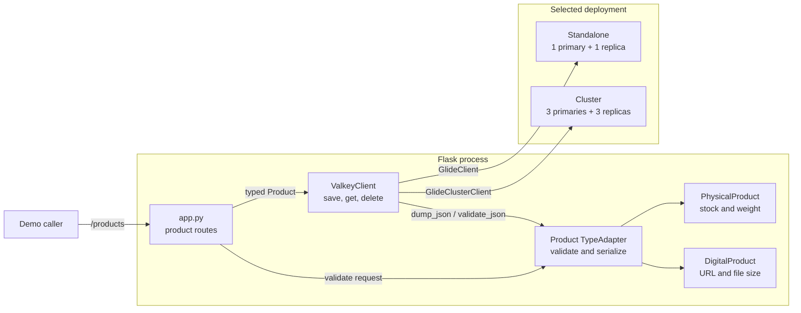
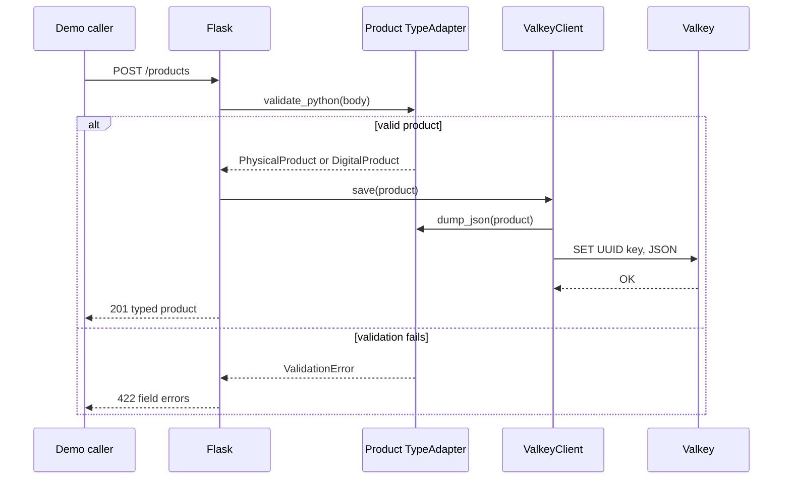

# Validated Object Storage Design

## Purpose

This capsule demonstrates a narrow object-storage pattern:

1. validate incoming JSON as a typed Pydantic object;
2. serialize the object into a normal Valkey string;
3. read the JSON back; and
4. reconstruct the correct Python type.

It extends the GLIDE quickstart without becoming an object mapper. There are
no secondary indexes, query language, migrations, or repository classes.

## Architecture

Pydantic owns the object contract. `ValkeyClient` owns both the GLIDE
connection and the typed serialization boundary.



Only one Valkey deployment runs at a time. Both use the same key and JSON
representation.

## Domain model

The union contains two meaningful variants instead of one model with many
optional fields.

| Model | Shared fields | Variant fields |
| --- | --- | --- |
| `PhysicalProduct` | UUID, name, decimal price, active, tags, created time | stock, weight |
| `DigitalProduct` | UUID, name, decimal price, active, tags, created time | download URL, file size |

The literal `kind` field is the discriminator:

```python
type Product = Annotated[
    PhysicalProduct | DigitalProduct,
    Field(discriminator="kind"),
]
```

This lets one `TypeAdapter[Product]` validate Python input, generate JSON, and
reconstruct the right variant.

## Validation boundary

Shared validation includes:

- a UUID identifier;
- a stripped name between 3 and 80 characters;
- a positive `Decimal` price with two decimal places;
- a boolean active state;
- at most five normalized tags;
- a timezone-aware creation time; and
- rejection of unexpected fields.

Physical products require non-negative stock and positive weight. Digital
products require an HTTP URL and a positive file size.

The request path is:

```text
receive JSON body
validate through PRODUCT_ADAPTER.validate_python()
if validation fails:
    return HTTP 422 with field errors
otherwise:
    pass a PhysicalProduct or DigitalProduct to ValkeyClient.save()
```

Validation occurs before `SET`, so invalid objects never reach Valkey.

## Persistence pseudocode

Each UUID maps to one namespaced key:

```text
valkey-examples:validated-object:product:<uuid>
```

`ValkeyClient` implements the persistence boundary:

```text
function save(product):
    key = prefix + product.id
    json_bytes = PRODUCT_ADAPTER.dump_json(product)
    GLIDE SET key json_bytes

function get(product_id):
    stored = GLIDE GET key
    if stored is null:
        return null
    return PRODUCT_ADAPTER.validate_json(stored)

function delete(product_id):
    return GLIDE DEL key deleted at least one key
```

The read path validates stored JSON again. The caller receives a typed model,
not an unvalidated dictionary.

## Request flow



Missing products return HTTP 404. Deletes are idempotent from the HTTP
caller's perspective and report whether a key existed.

## Connection selection

The connection code remains intentionally small:

```text
load .env
parse VALKEY_ADDRESSES into NodeAddress values
if VALKEY_MODE is cluster:
    create GlideClusterClient
else:
    create GlideClient
```

This capsule trusts the environment in the same way as the quickstart. Its
learning objective is object validation and reconstruction, not configuration
validation.

## Runtime ownership

`main()` creates one `ValkeyClient`, registers `close()` with `atexit`, builds
the Flask app, and starts Waitress. The application factory accepts an
optional client so unit tests can inject a fake.

Compose offers a standalone pair and a six-node cluster. Only Flask is
published to the host.

## Design decisions

- One `TypeAdapter` prevents duplicate variant-selection logic.
- A discriminated union makes invalid combinations impossible without adding
  inheritance machinery beyond the shared model.
- JSON in ordinary Valkey strings keeps the storage mechanism visible.
- `ValkeyClient` combines connection and serialization because the capsule has
  one caller and one aggregate. A repository layer would add navigation
  without adding a useful substitution seam.
- UUID-derived single keys work identically in standalone and cluster modes.

## Limits and extension points

Add a new product variant by defining its model, adding it to `Product`, and
updating demo payloads and tests. Keep the `kind` discriminator stable.

A production object store would also need schema-version policy, migrations,
authorization, concurrency control, indexes, query behavior, TLS, and ACLs.
Those concerns are intentionally outside this capsule.
