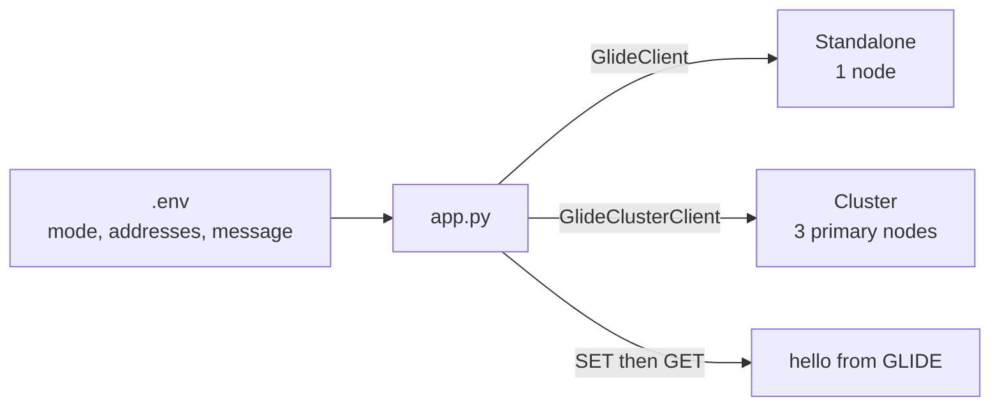

# Minimal Valkey GLIDE Python Connection

This is the 30-second Python and Valkey GLIDE demo. One
[`app.py`](src/valkey_connection/app.py) loads `.env`, creates either
`GlideClient` or `GlideClusterClient`, runs `SET` and `GET`, prints the value,
and closes the connection.

There is no Flask, settings model, client wrapper, repository layer, telemetry,
or custom error handling.

## What you will see

The same Python file prints:

```text
hello from GLIDE
```

against either:

- one standalone Valkey node; or
- the minimum three-primary Valkey Cluster.

## Documentation

- [Design and pseudocode](docs/DESIGN.md)
- [30-second video runbook](docs/DEMO.md)
- [Build-from-scratch tutorial](docs/TUTORIAL.md)

## Quick start

Prerequisites are Docker with Compose, Python 3.14, uv, Make, ShellCheck, and
bat.

Prepare and start the standalone topology:

```shell
make setup
make start
```

Run the complete application:

```shell
make demo
```

Expected output:

```text
hello from GLIDE
```

Clean up:

```shell
make reset
make stop
```

## Switch to cluster

Change the first two values in `.env`:

```dotenv
VALKEY_MODE=cluster
VALKEY_ADDRESSES=cluster-node-1:6379,cluster-node-2:6379,cluster-node-3:6379
```

Run the same commands:

```shell
make start
make demo
make stop
```

Only the GLIDE constructor changes. The `SET` and `GET` code remains identical.

## The complete application path

```python
load_dotenv()

client = create_client()
try:
    client.set(DEMO_KEY, os.environ["VALKEY_MESSAGE"])
    stored = client.get(DEMO_KEY)
    print(stored.decode())
finally:
    client.close()
```

The checked-in implementation keeps the repeated commands in a small `run`
function so unit tests can use the GLIDE boundary without starting Valkey.

## Architecture

The app container and the selected Valkey topology share one private Compose
network. No service port is published to the host.



## Lifecycle and verification

```shell
make setup
make start
make demo
make reset
make verify
make stop
```

`make reset` deletes only
`valkey-examples:client-connection:message`. `make verify` runs Ruff,
ShellCheck, strict mypy, unit tests, and the public application command against
both real topologies.

## Versions and resource expectations

- Python 3.14.7
- valkey-glide-sync 2.5.1
- python-dotenv 1.2.3
- Valkey 9.1.1 Alpine

Allow up to 2 CPU cores, 1 GB of memory, 2 GB of disk, 1 GB of initial
downloads, and 10 minutes for the first full verification. Cached demo runs
are much faster.

## Security and production limitations

Valkey uses no authentication or TLS, but stays on the private Compose network.
Configuration is intentionally trusted and missing values fail naturally. The
three-node cluster has no replicas or failover. This capsule demonstrates
client construction, not a production deployment.

The default journey requires no credentials or third-party data.
Repository-authored content is MIT licensed; dependencies and container images
retain their own licenses.

This capsule is a candidate owned by `rlunar`, with `valkey-io` as backup.
Repository admission remains blocked until the maintainers, reviewers, and
runtime CI described in the repository root are established.
