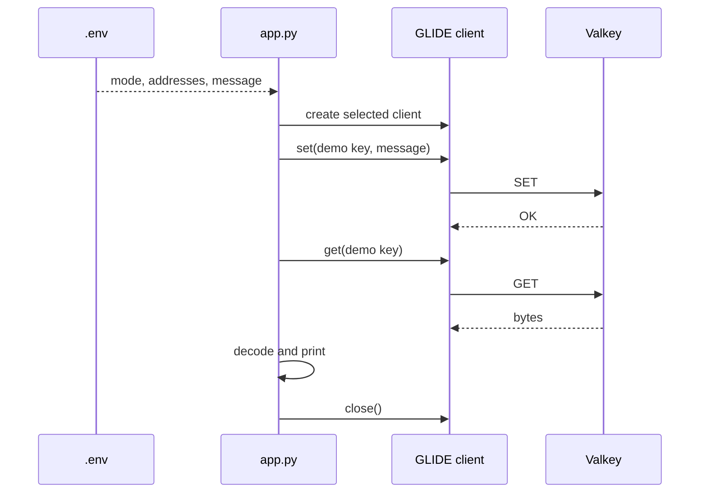

# Minimal Valkey GLIDE Connection Design

## Purpose

This capsule optimizes for one short explanation: dotenv supplies connection
values, GLIDE creates the selected client, and normal `SET` and `GET` commands
work the same in standalone and cluster mode.

Application behavior remains in one file. Docker and shell files exist only to
make both real topologies repeatable.

## Architecture

The application runs in a glibc-based Python container because the GLIDE wheel
contains native code. Valkey itself uses the smaller official Alpine image.
All processes share a private Compose network.

```mermaid
flowchart LR
    env[".env"]

    subgraph python["Python app container"]
        app["app.py"]
        constructor{"VALKEY_MODE"}
        app --> constructor
    end

    subgraph deployments["Selected Valkey deployment"]
        standalone["Standalone<br/>1 node"]
        cluster["Cluster<br/>3 primaries"]
    end

    env --> app
    constructor -->|"standalone"| standalone
    constructor -->|"cluster"| cluster
    standalone -->|"SET / GET"| app
    cluster -->|"SET / GET"| app
```

Only one deployment branch runs at a time. No port is published because the
one-shot app executes inside the same network.

## Responsibilities

| File | Responsibility |
| --- | --- |
| `app.py` | Load dotenv, create GLIDE, run `SET` and `GET`, close |
| `.env` | Select mode, addresses, and message |
| `compose.yaml` | Provide one standalone node or three cluster nodes |
| `scripts/` | Start, run, reset, verify, and stop |

There is no client class. `create_client()` is a function because it performs
one decision and returns the SDK object used by the rest of the file.

## Pseudocode

```text
load .env

split VALKEY_ADDRESSES into NodeAddress objects

if VALKEY_MODE is cluster:
    client = create GlideClusterClient
else:
    client = create GlideClient

try:
    SET the known key to VALKEY_MESSAGE
    GET the known key
    decode and print the result
finally:
    close the client
```

Configuration is deliberately trusted. This keeps failures visible and avoids
teaching validation machinery in a connection demo.

## Command sequence



## Topologies

Standalone uses one Valkey node. The cluster uses three primary nodes and no
replicas, which is the minimum useful layout for demonstrating cluster-aware
routing. It intentionally provides no failover.

The cluster initializer runs only when the nodes do not already report
`cluster_state:ok`, keeping `make start` idempotent.

## Data and cleanup

The capsule owns one key:

```text
valkey-examples:client-connection:message
```

`make reset` deletes only that key. `make stop` removes this capsule's
containers, network, and temporary data.

## Extension boundary

Use the Flask quickstart when a demo needs HTTP. Use the topology-aware Flask
capsule when it needs Sentinel, validated settings, observability, readiness,
or stable error handling. Those concerns do not belong in this 30-second path.
