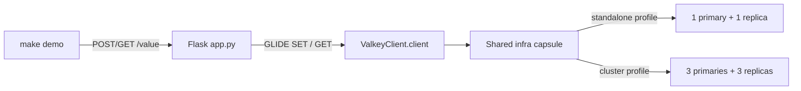

# Valkey GLIDE Flask Client Quickstart

In this 60-second Flask and Valkey GLIDE demo, you keep the connection choice
in one small class. You can see the actual `SET` and `GET` calls in
[`app.py`](src/valkey_quickstart/app.py).

Use the longer
[topology-aware Flask capsule](../topology-aware-python-flask/) when a demo
needs validated settings, Sentinel, structured telemetry, readiness endpoints,
or production-oriented error handling.

**Level:** [`L100` — Beginner](../../../docs/authoring.md#choose-the-level)

## Start here

You should know basic Python and that a web route connects a URL to a Python
function. The application follows this path:

1. Flask receives `POST /value`;
2. GLIDE runs `SET` to store the value;
3. Flask receives `GET /value`;
4. GLIDE runs `GET`; and
5. Flask returns the stored value as JSON.

Key words:

- **route:** a URL and HTTP method handled by one Python function;
- **client:** the object that sends commands to Valkey;
- **primary:** the node that accepts writes;
- **replica:** a node that keeps a copy of the primary's data; and
- **shard:** one part of the keyspace in a cluster.

A Flask route works like a door in *Monsters, Inc.*: each URL opens into one
specific Python function.

Read the code in this order:

1. [`app.py`](src/valkey_quickstart/app.py) for the HTTP routes;
2. [`valkey_client.py`](src/valkey_quickstart/valkey_client.py) for connection
   creation; and
3. [`scripts/demo.py`](scripts/demo.py) for the two visible HTTP requests.

## What you will see

You run the same Flask code to store and retrieve one value against either:

- standalone Valkey: one primary and one replica; or
- Valkey Cluster: three primary shards and one replica per shard.

`ValkeyClient` reads `VALKEY_MODE` and `VALKEY_ADDRESSES` directly from the
environment. The capsule assumes those values are correct and fails naturally
when they are missing or unusable.

## Documentation

- [Design and pseudocode](docs/DESIGN.md)
- [60-second demo runbook](docs/DEMO.md)
- [Build-from-scratch tutorial](docs/TUTORIAL.md)
- [Short reel script](docs/SCRIPT_REEL.md)
- [Longer tutorial-video script](docs/SCRIPT_VIDEO.md)

## Shared infrastructure

[`example.yaml`](example.yaml) points to the root
[infrastructure capsule](../../../infra/README.md) and selects
`valkey-standalone-replicated` or `valkey-cluster-6`. The local `compose.yaml`
contains only the Flask application services.

## 60-second walkthrough

Prerequisites are Docker with Compose, Python 3.14, uv, Make, ShellCheck,
HTTPie, jq, and bat. Install the locked environment once:

```shell
cp .env.example .env
make setup
```

Run the standalone demonstration:

```shell
make start
make demo
make stop
```

You should see Valkey store the value and return it:

```text
POST /value -> {"value": "hello from standalone"}
GET  /value -> {"value": "hello from standalone"}
```

Run the same application against the six-node cluster:

```shell
TOPOLOGY=cluster make start
TOPOLOGY=cluster make demo
make stop
```

## The important code

`app.py` creates the object once:

```python
valkey = ValkeyClient()
app = create_app(valkey)
```

The routes then use the GLIDE client directly:

```python
valkey.client.set(DEMO_KEY, value)
stored_bytes = valkey.client.get(DEMO_KEY)
```

There is no store layer, settings model, health endpoint, or custom exception
hierarchy in this quickstart.

## Architecture

The wrapper contains only connection creation. The commands remain in the
Flask module so the complete teaching path fits on one screen.



The standalone client receives both node addresses and writes to the primary.
The cluster client starts from the configured seed addresses and routes the
key to its owning shard.

## Configuration

The application reads exactly these variables:

| Variable | Example | Purpose |
| --- | --- | --- |
| `VALKEY_MODE` | `standalone` | Select the standalone or cluster GLIDE client |
| `VALKEY_ADDRESSES` | `standalone-primary:6379,standalone-replica:6379` | Comma-separated bootstrap nodes |
| `FLASK_HOST` | `0.0.0.0` | Waitress bind host |
| `FLASK_PORT` | `8000` | Waitress and loopback publication port |

The shared infrastructure capsule supplies topology-specific Valkey addresses
to the application-only Compose services. `.env.example` also contains every
variable needed to run the standalone configuration directly from a compatible
network.

## Lifecycle and verification

```shell
make reset
make verify
make stop
```

`make reset` sends `DELETE /value`, which removes only
`valkey-examples:client-quickstart:message`. `make verify` runs Ruff,
ShellCheck, mypy, unit tests, and real integration and HTTP journeys against
both topologies.

## Versions and resource expectations

- Python 3.14.7
- Flask 3.1.3
- valkey-glide-sync 2.5.1
- Valkey 9.1.1

Allow up to 4 CPU cores, 2 GB of memory, 3 GB of disk, 1.5 GB of initial
downloads, and 15 minutes for the full first verification. Normal demo startup
is much shorter once images and packages are cached.

## Security and production limitations

The Flask port binds to loopback. Valkey nodes stay on the private Compose
network, but use no authentication or TLS. Configuration and request bodies
are deliberately trusted, and dependency exceptions are not converted into a
stable error contract. Do not use this capsule as a production deployment
reference.

The default journey requires no credentials and uses no third-party data.
Repository-authored content is MIT licensed; dependencies and container images
retain their own licenses.

This capsule is a candidate owned by `rlunar`, with `valkey-io` as backup.
Repository admission remains blocked until the maintainers, reviewers, and
runtime CI described in the repository root are established.
