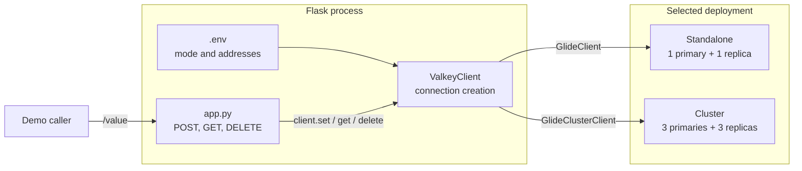
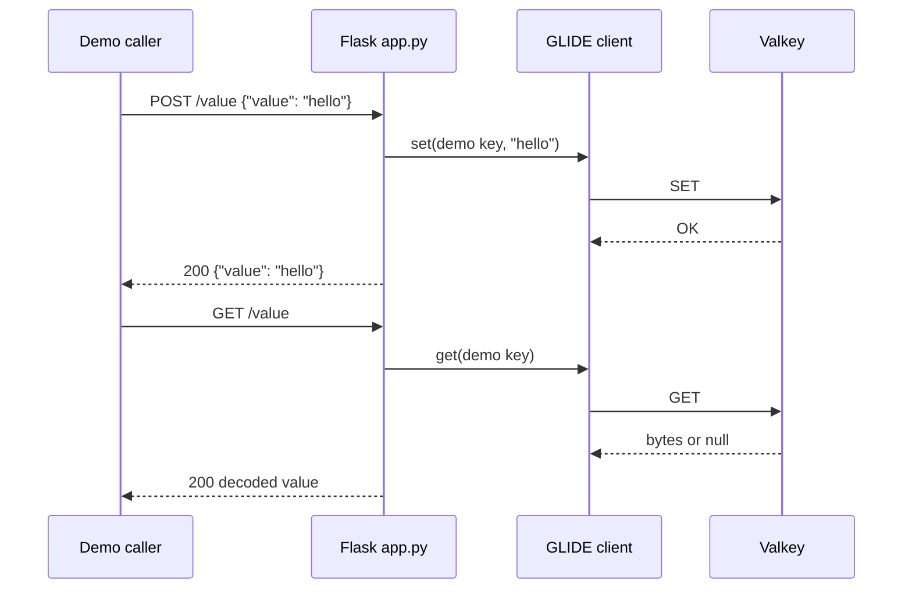

# Valkey GLIDE Flask Quickstart Design

## Purpose

This capsule is optimized for a short demonstration. A viewer should be able
to open `app.py`, see a `ValkeyClient` object being created, and see ordinary
GLIDE `SET`, `GET`, and `DEL` calls without first learning a configuration
framework or application service layer.

The design intentionally trusts `.env`. Missing or malformed values fail at
startup through normal Python, GLIDE, or operating-system exceptions.

## Architecture

`ValkeyClient` only creates and closes the selected GLIDE client. Flask uses
the public client directly so the data commands remain visible in one file.



Only one deployment branch is active. Compose provides the container addresses
that the wrapper reads from the environment.

## Responsibilities

| File | Responsibility |
| --- | --- |
| `valkey_client.py` | Load `.env`, parse addresses, create the GLIDE client |
| `app.py` | Create Flask, execute commands, decode the stored value |
| `compose.yaml` | Provide standalone and cluster topologies |
| `scripts/` | Start, demonstrate, verify, reset, and stop |

There is no store layer, settings model, repository abstraction, health
endpoint, or custom exception hierarchy.

## Client construction pseudocode

```text
load .env

for each comma-separated VALKEY_ADDRESSES entry:
    split host and port
    create NodeAddress

if VALKEY_MODE equals "cluster":
    client = GlideClusterClient.create(addresses)
else:
    client = GlideClient.create(addresses)
```

Any value other than `cluster` selects the standalone client. This keeps the
teaching code small and is a deliberate tradeoff, not production validation.

## Application construction pseudocode

```text
function create_app(optional ValkeyClient):
    valkey = supplied object or ValkeyClient()
    app = Flask()
    store valkey in app.extensions

    register one /value route for GET, POST, and DELETE
    return app

function main():
    valkey = ValkeyClient()
    close valkey at process exit
    app = create_app(valkey)
    serve app with Waitress
```

Dependency injection is limited to one optional object. Unit tests can supply
a fake without adding a larger abstraction.

## Request flow



The application does not convert dependency errors into a stable HTTP error
contract. A bad configuration or unavailable topology is allowed to fail
visibly.

## Data representation

The capsule owns one key:

```text
valkey-examples:client-quickstart:message
```

The value is the UTF-8 string supplied in the JSON request. `make reset`
deletes only this key.

## Topology notes

The standalone Compose profile starts one primary and one replica. Both
addresses are supplied to `GlideClient`.

The cluster profile starts six nodes and initializes three primary shards with
one replica each. The application receives three seed addresses and GLIDE
discovers the cluster layout.

## Extension boundary

Add code to this capsule only when it preserves the one-screen teaching path.
Use the longer topology-aware capsule when a demo needs validated settings,
Sentinel, readiness, structured telemetry, or stable error handling.
