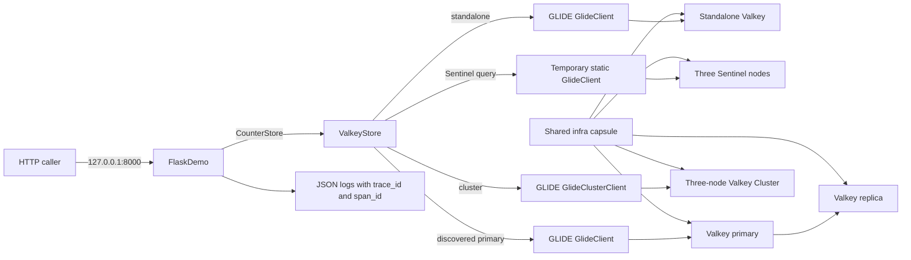
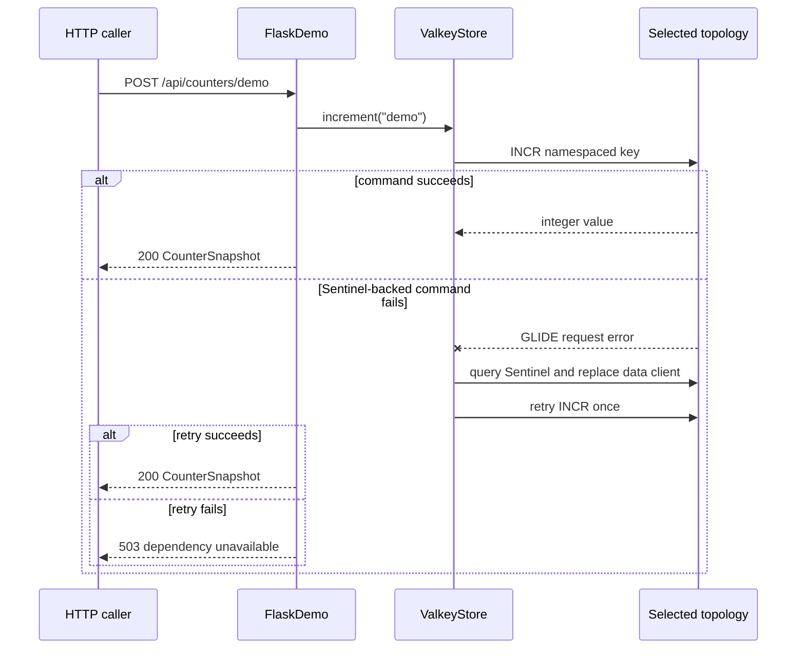

# Topology-Aware Flask Application with Python and GLIDE

You run the same Flask counter application with three Valkey setups: one
server, a primary watched by Sentinel, or a cluster. You keep the Flask routes
the same and change only the connection code.

**Level:** [`L300` — Advanced](../../../docs/authoring.md#choose-the-level)

> [!IMPORTANT]
> This is an educational local environment, not a production architecture.
> Valkey runs without authentication or TLS, and Sentinel support is an
> application-owned discovery adapter because Valkey GLIDE does not currently
> expose a native Sentinel client.

## Start here

You should know Python classes, Flask routes, and basic Valkey commands. You do
not need prior Sentinel or OpenTelemetry experience.

The application follows this path:

1. settings choose standalone, Sentinel, or cluster;
2. `ValkeyStore` opens the matching GLIDE connection;
3. every route calls the same `get`, `increment`, or `delete` method;
4. Sentinel mode asks Sentinel which node is the current primary; and
5. request logs record the selected setup and timing.

Key words:

- **topology:** the way Valkey servers are arranged;
- **Sentinel:** a separate process that watches a primary and can promote a
  replica;
- **discovery:** asking where the current primary is;
- **store:** the class that owns Valkey commands and connections; and
- **telemetry:** logs and traces that show what the application did.

Think of Sentinel as Mission Control: several processes watch the primary,
agree when it has failed, and coordinate a replacement.

Read the code in this order:

1. [`app.py`](src/valkey_flask_demo/app.py) for the routes;
2. [`store.py`](src/valkey_flask_demo/store.py) for connection choices;
3. [`config.py`](src/valkey_flask_demo/config.py) for environment settings;
   and
4. [`telemetry.py`](src/valkey_flask_demo/telemetry.py) last, because logging
   and trace export are optional to the counter lesson.

## What you will learn

You will run one Flask application against three Valkey topologies and observe:

- `GlideClient` for standalone;
- GLIDE-based Sentinel discovery followed by `GlideClient` to the primary;
- `GlideClusterClient` for cluster routing;
- validated Pydantic Settings loaded from environment variables;
- OpenTelemetry-enriched JSON request logs; and
- identical counter behavior through every topology.

Most of the Valkey logic is in
[`store.py`](src/valkey_flask_demo/store.py). The routes call a small set of
methods and do not need to know how each connection works.

## Documentation

- [Design and pseudocode](docs/DESIGN.md)
- [Step-by-step demo runbook](docs/DEMO.md)
- [Build-from-scratch tutorial](docs/TUTORIAL.md)
- [Short reel script](docs/SCRIPT_REEL.md)
- [Longer tutorial-video script](docs/SCRIPT_VIDEO.md)

## Shared infrastructure

[`example.yaml`](example.yaml) points to the root
[infrastructure capsule](../../../infra/README.md) and selects
`valkey-standalone`, `valkey-sentinel`, or `valkey-cluster-3`. The local
`compose.yaml` contains only the Flask application variants.

## Prerequisites

- Docker with Docker Compose;
- Python 3.14.7;
- [uv](https://docs.astral.sh/uv/) 0.12.5 or newer;
- Make and ShellCheck for verification;
- HTTPie, jq, and bat for the presenter-facing CLI commands; and
- approximately 4 CPU cores, 2 GB memory, 3 GB disk, and 1.5 GB of first-run
  downloads.

The first setup and image build can take several minutes. Later starts should
complete within one minute on a typical development machine.

## Quick start

Install the locked development environment:

```shell
make setup
```

Start the default standalone topology:

```shell
make start
make demo
make reset
make stop
```

Run the same application with Sentinel:

```shell
TOPOLOGY=sentinel make start
TOPOLOGY=sentinel make demo
TOPOLOGY=sentinel make stop
```

Run it with Valkey Cluster:

```shell
TOPOLOGY=cluster make start
TOPOLOGY=cluster make demo
TOPOLOGY=cluster make stop
```

Typical Sentinel output is:

```text
Topology: sentinel
GLIDE client: GlideClient
Sentinel primary: sentinel-primary:6379
Counter values: 1 -> 2
Stored value: 2
```

The application is available at `http://127.0.0.1:8000` by default.

## HTTP interface

| Method and path | Behavior |
| --- | --- |
| `GET /` | Lists the demo endpoints |
| `GET /health/live` | Confirms the Flask process is running |
| `GET /health/ready` | Pings Valkey through the selected client |
| `GET /api/topology` | Reports safe topology and client details |
| `GET /api/counters/<name>` | Reads a counter, returning zero when absent |
| `POST /api/counters/<name>` | Atomically increments a counter |
| `DELETE /api/counters/<name>` | Deletes that one counter |

Counter names must match `[a-z0-9][a-z0-9_-]{0,63}`.

## Architecture

The Flask routes depend on one deep module rather than branching on topology.



Only the Flask port is published. The shared infrastructure capsule creates
the Valkey and Sentinel processes inside the capsule-isolated private Compose
network.

## Request and recovery flow



Standalone and cluster reconnection remain GLIDE responsibilities. The
application owns only the Sentinel rediscovery step that GLIDE does not provide.

## Code organization

- `AppSettings` validates configuration before network access.
- `ValkeyStore` owns one process-lifetime data client and all topology logic.
- `FlaskDemo` owns route registration, error mapping, and response models.
- `telemetry.py` configures JSON logging, Flask spans, optional OTLP log and
  trace export, and optional GLIDE trace export.
- Pydantic models define the stable JSON responses.

The object model is intentionally small. The two behavior-rich classes are the
store and the Flask adapter; configuration and response models carry data.
See the [design notes](docs/DESIGN.md) for the rationale, pseudocode, and
extension points.

## Configuration

Copy `.env.example` to `.env` only when you need overrides. Compose supplies
topology-specific addresses automatically.

| Variable | Default | Description |
| --- | --- | --- |
| `TOPOLOGY` | `standalone` | Compose profile selected by the Make targets |
| `VALKEY_TOPOLOGY` | `standalone` | Application topology mode |
| `VALKEY_ADDRESSES` | topology-specific | Comma-separated `host:port` bootstrap addresses |
| `VALKEY_SENTINEL_MASTER` | `demo-primary` | Sentinel master group |
| `VALKEY_DATABASE_ID` | `0` | Standalone database; cluster requires zero |
| `VALKEY_REQUEST_TIMEOUT_MS` | `1000` | Bounded GLIDE command timeout |
| `VALKEY_CONNECTION_TIMEOUT_MS` | `2000` | Bounded TCP connection timeout |
| `VALKEY_KEY_PREFIX` | `valkey-examples:flask-base:v1` | Capsule key namespace |
| `FLASK_PORT` | `8000` | Loopback-published application port |
| `FLASK_THREADS` | `4` | Waitress worker threads |
| `LOG_LEVEL` | `INFO` | Python logging threshold |
| `OTEL_ENABLED` | `true` | Flask span and log-correlation switch |
| `OTEL_SERVICE_NAME` | `valkey-flask-demo` | OpenTelemetry service resource |
| `OTEL_EXPORTER_OTLP_ENDPOINT` | unset | Optional OTLP HTTP base endpoint |

When you configure an OTLP endpoint, the application appends `/v1/traces` and
`/v1/logs`. GLIDE traces use the same trace endpoint. The console remains
readable JSON and includes `trace_id` and `span_id`.

## Verification

Run the complete capsule verification:

```shell
make verify
```

It performs:

1. Ruff formatting and lint checks;
2. ShellCheck;
3. strict mypy checks;
4. unit tests with coverage;
5. Compose configuration and repository structure checks; and
6. real store-contract and HTTP journey tests against standalone, Sentinel,
   and cluster.

The real tests create UUIDv7-scoped keys and delete only those keys. They never
run `FLUSHDB`.

## Lifecycle

| Command | Effect |
| --- | --- |
| `make setup` | Install exact dependencies from `uv.lock` |
| `make start` | Build and start the selected topology and Flask app |
| `make demo` | Show topology details and increment the `demo` counter |
| `make verify` | Run all static and runtime checks |
| `make reset` | Delete only the `demo` counter |
| `make stop` | Remove this capsule's containers, network, and volumes |

`make stop` is safe after a partial startup because it scopes cleanup to the
fixed Compose project name.

## Versions

- Python 3.14.7
- Flask 3.1.3
- Waitress 3.0.2
- Pydantic 2.13.4
- Pydantic Settings 2.15.0
- Valkey GLIDE sync 2.5.1
- Valkey 9.1.1
- OpenTelemetry Python 1.44.0 / instrumentation 0.65b0

Direct dependencies and container images are pinned. `uv.lock` pins transitive
Python dependencies.

## Security and production differences

- Local Valkey and Sentinel instances have no ACLs or TLS.
- Flask binds inside its container, but Compose publishes it only on
  `127.0.0.1`.
- No Valkey data port is published to the host.
- The demo has no authentication or authorization layer.
- Configuration supports an OTLP endpoint but does not provision a collector
  or credentials.
- Sentinel discovery retries one failed command after rediscovery. A production
  system should use a client with first-class Sentinel support and a
  workload-specific failover test.
- Add TLS, ACLs, secret injection, resource limits, health policy, deployment
  orchestration, and an observability backend before adapting this pattern to
  production.

Repository-authored code is MIT-licensed. The Python dependencies and container
images retain their upstream licenses.

## Status and support

This capsule is a `candidate`. Repository maintainer and Python reviewer
appointments, blocking runtime/security CI, and an independent clean-clone
reproduction are still required before catalog admission.
