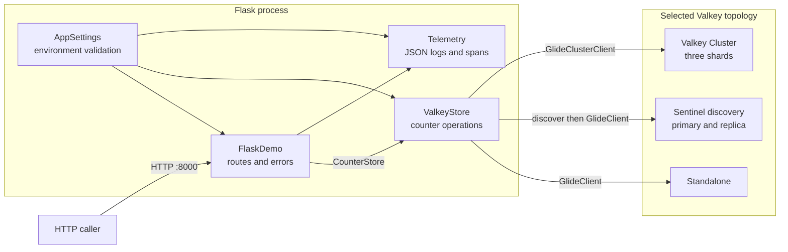
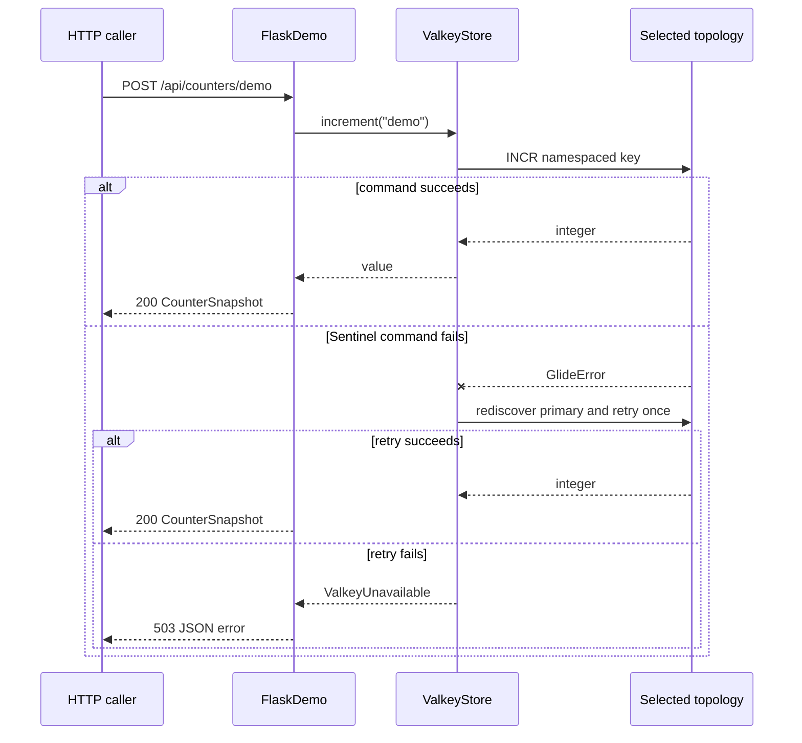

# Topology-Aware Flask Demo Design

## Purpose

This capsule is a reusable foundation for synchronous Flask demonstrations
that need Valkey configuration, topology selection, observability, tests, and
safe lifecycle commands. It is intentionally an application example rather
than a framework or released library.

The design favors a few behavior-rich modules:

- `FlaskDemo` owns HTTP behavior;
- `ValkeyStore` owns Valkey behavior;
- `AppSettings` owns validated configuration; and
- `telemetry.py` owns process-wide logging and tracing setup.

## Architecture

The Flask layer depends on one store interface. The store hides the selected
GLIDE client and all Sentinel-specific discovery and recovery behavior.



Only one topology branch is active for a process. Flask routes never inspect
the topology or instantiate a GLIDE client.

## Module responsibilities

| Module | Responsibility | Deliberately does not own |
| --- | --- | --- |
| `config.py` | Parse and validate environment-backed settings | Network access |
| `models.py` | Stable response shapes | Persistence behavior |
| `store.py` | GLIDE construction, commands, Sentinel recovery, key names | HTTP status codes |
| `telemetry.py` | JSON logging, Flask spans, optional OTLP export | Route behavior |
| `app.py` | Application factory, routes, errors, request lifecycle | Topology branching |

The two main classes earn their boundaries because removing either would push
substantial behavior into unrelated modules. Configuration and response models
remain data-focused.

## Application construction

The public construction seam is the application factory:

```python
create_app(settings=None, store=None)
```

Its behavior can be summarized as:

```text
function create_app(optional settings, optional store):
    runtime_settings = supplied settings or load AppSettings from environment
    configure JSON logging and optional OpenTelemetry
    runtime_store = supplied store or connect ValkeyStore(runtime_settings)
    create FlaskDemo(runtime_settings, runtime_store)
    return its Flask application
```

Tests inject a fake `CounterStore`. Normal execution creates one
process-lifetime `ValkeyStore`.

## Topology selection

`ValkeyStore` keeps the variation private:

```text
function connect(settings):
    if topology is cluster:
        return GlideClusterClient(cluster bootstrap addresses)

    if topology is sentinel:
        primary = discover primary through Sentinel
        remember primary for topology reporting
        return GlideClient(primary, static discovery)

    return GlideClient(standalone addresses, standard discovery)
```

Standalone and cluster reconnect behavior remains the GLIDE client's
responsibility. Sentinel requires an application-owned adapter because the
client used by this capsule does not expose a Sentinel client.

## Sentinel discovery and recovery

Sentinel discovery uses a short-lived static standalone GLIDE client so the
Sentinel node is treated as a command endpoint rather than a data primary.

```text
function discover_sentinel_primary():
    for each configured Sentinel address:
        open a temporary static RESP2 GlideClient
        run SENTINEL GET-MASTER-ADDR-BY-NAME
        validate and return the host and port
        always close the temporary client

    raise ValkeyUnavailable with the attempted addresses
```

Commands against the Sentinel-backed data client use one bounded retry:

```text
function run(operation):
    if topology is not sentinel:
        run operation and translate GlideError

    acquire process-local Sentinel lock
    try operation
    if it fails:
        discover the current primary
        create the replacement client
        swap clients and close the old client
        retry operation once
```

The lock prevents concurrent requests from replacing the same process client
at the same time. It is not a distributed lock.

## Request flow

The counter route validates the name before creating a namespaced key.



Invalid counter names return HTTP 400. A dependency failure is translated to
HTTP 503 without exposing connection details.

## Keys and cluster behavior

Every operation touches one key:

```text
valkey-examples:flask-base:v1:counter:<validated-name>
```

Single-key operations do not require a cluster hash tag. `make reset` deletes
only the `demo` counter, and real tests create unique names before deleting
them during cleanup.

## Configuration

`AppSettings` is immutable and validates configuration before
`ValkeyStore` opens a connection. It checks address syntax, port ranges,
cluster database restrictions, key-prefix characters, timeouts, and optional
OTLP endpoint schemes.

The settings object returns parsed addresses through one method so client
construction does not repeat parsing logic.

## Observability

The application always emits JSON logs. With OpenTelemetry enabled:

- Flask instrumentation creates request spans;
- logging instrumentation adds trace and span identifiers;
- an optional OTLP endpoint receives application spans and logs; and
- GLIDE traces use the same trace endpoint when configured.

The OTLP backend remains optional so the default demo is credential-free and
self-contained.

## Runtime ownership

`main()` creates one store, registers `close()` with `atexit`, and serves the
application through Waitress. Request teardown does not close the store
because teardown runs after every request.

Compose owns the application and Valkey processes. Only the Flask port is
published to the host.

## Extension guide

To use this capsule as the base for another Flask demo:

1. keep configuration, telemetry, lifecycle scripts, and application factory;
2. replace `CounterSnapshot` with the new response models;
3. replace the counter methods with a small capability-oriented store
   interface;
4. keep topology selection private to the Valkey implementation; and
5. update the shared integration contract for every supported topology.

Avoid creating a class per route, command, response, or topology unless a
second implementation creates a useful substitution seam.

## Tradeoffs

- The topology branch inside `ValkeyStore` is simpler than three mostly
  identical public store classes.
- The Sentinel adapter is useful for education but is not a substitute for a
  client with first-class Sentinel support.
- Process-wide telemetry setup keeps route code clean but assumes one
  application configuration per Python process.
- A synchronous client and Waitress make request flow easy to follow; an
  asynchronous application would need a different lifecycle and concurrency
  model.
