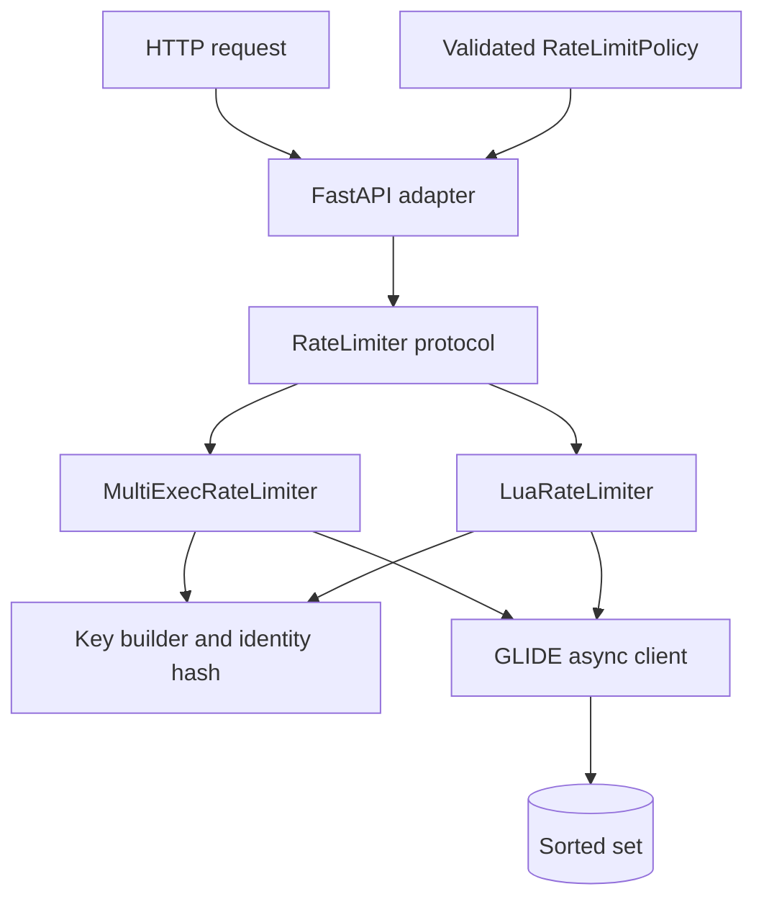
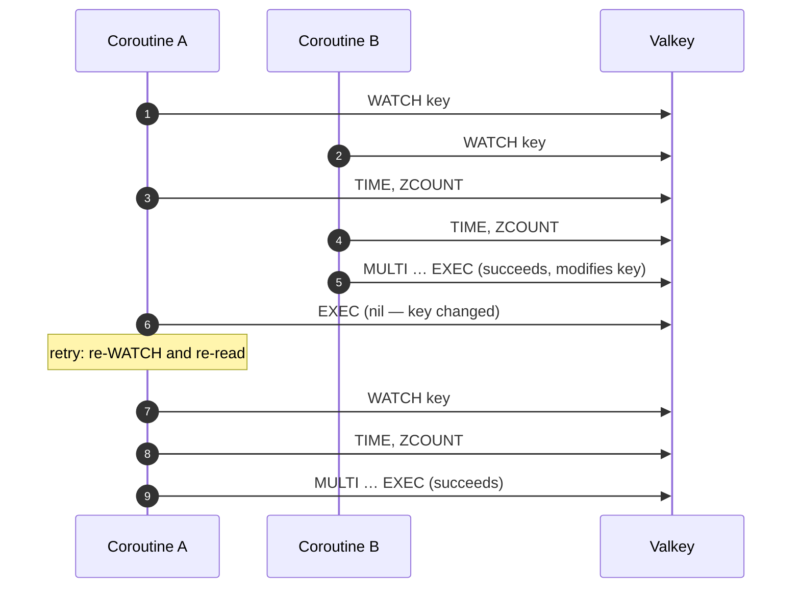
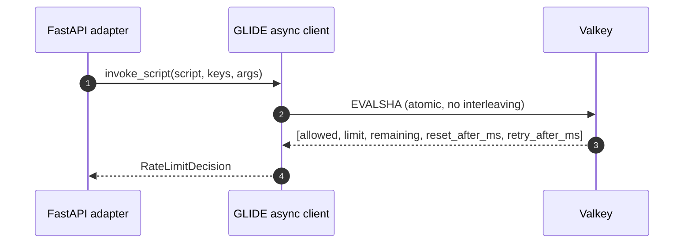
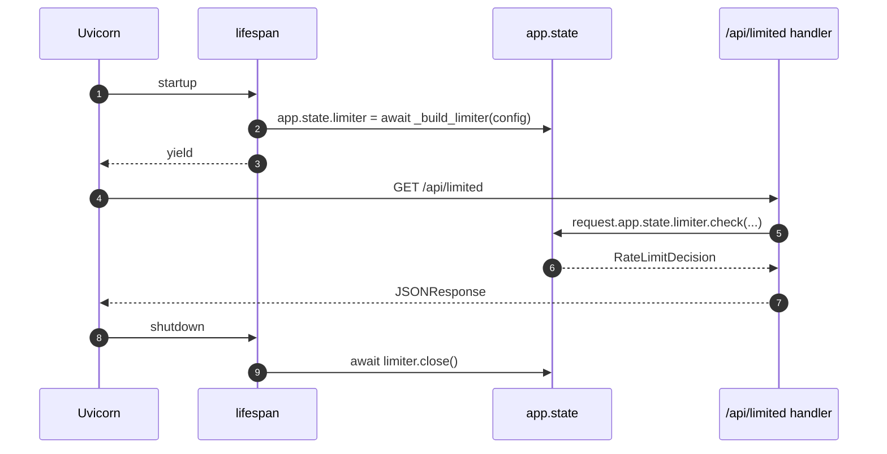

# Design: Sliding-Window Rate Limiter with FastAPI

## Objective

Teach a true sliding-window log using Valkey sorted sets while making two
atomicity techniques directly comparable behind one Python interface.

The implementation uses Python 3.14+, uv, FastAPI, Uvicorn, asynchronous
Valkey GLIDE, and Valkey 9.1.1 on the pinned Trixie image. `multi-exec` is
the default; `lua` is selected through an immutable `pydantic-settings`
configuration model.

## Components



The FastAPI adapter knows only the shared decision contract. It does not know
sorted-set command order, transaction retries, script return positions, or key
layout.

## Data model

One key exists per policy and caller identity:

```text
<prefix>:<policy-id>:<sha256(identity)>
```

The raw `X-Client-ID` is never placed in a key or demo state display.

Each accepted request becomes one sorted-set member:

```text
member = <server-time-ms>:<uuidv7-request-id>
score  = <server-time-ms>
```

The UUIDv7 request ID prevents same-millisecond requests from overwriting each
other while preserving time-ordering. Denied requests are not inserted. The key
TTL is refreshed only after an accepted request, so inactive identities
disappear without a cleanup job.

## Decision semantics

For server time `now`, window `W`, and limit `L`:

1. remove scores less than or equal to `now - W`;
2. count active members;
3. accept only when the count is less than `L`;
4. on acceptance, add the unique member and set a `W` millisecond TTL;
5. read the oldest active score;
6. calculate remaining capacity and reset or retry timing.

An event exactly on the lower boundary is expired. The represented interval is
`(now - W, now]`.

## Implementation pseudocode

```python
async def check(identity, policy, request_id):
    key = f"{prefix}:{policy.policy_id}:{sha256(identity)}"
    for attempt in range(max_retries):
        await client.watch([key])
        now_ms = await server_time_ms(client)
        cutoff_ms = now_ms - policy.window_ms
        count = await client.zcount(key, cutoff_ms+1, "+inf")
        allowed = count < policy.limit
        tx = Batch(atomic=True)
        tx.zremrangebyscore(key, "-inf", cutoff_ms)
        if allowed:
            tx.zadd(key, {f"{now_ms}:{request_id}": now_ms})
            tx.pexpire(key, policy.window_ms)
        tx.zcard(key)
        tx.zrange_withscores(key, 0, 0)
        result = await client.exec(tx)
        if result is None:
            continue   # WATCH conflict; retry
        return build_decision(allowed, policy, result[-2], now_ms, oldest(result[-1]))
    raise RateLimitDependencyError("too many retries")
```

```lua
-- sliding_window.lua (server-side, atomic by definition)
local now_ms = server_time_ms()
local cutoff_ms = now_ms - window_ms
redis.call("ZREMRANGEBYSCORE", key, "-inf", cutoff_ms)
local count = redis.call("ZCARD", key)
local allowed = count < limit
if allowed then
    redis.call("ZADD", key, now_ms, now_ms .. ":" .. request_id)
    redis.call("PEXPIRE", key, window_ms)
    count = count + 1
end
-- return {allowed, limit, remaining, reset_after_ms, retry_after_ms}
```

## WATCH/MULTI/EXEC concurrency sequence



## Lua atomic-decision sequence



## Lifespan and connection management

The GLIDE client is created once inside the FastAPI `lifespan` context manager
and stored in `app.state.limiter`. All request handlers read the limiter from
`request.app.state` without creating new connections. On shutdown the lifespan
context calls `await limiter.close()`.



## Security design

- FastAPI binds to `127.0.0.1:8000`; Valkey binds to `127.0.0.1:6379`.
- No credentials or TLS — this is a credential-free local learning journey.
- `X-Client-ID` is SHA-256 hashed before use in any Valkey key.
- Demo identities are synthetic and non-sensitive.
- Interactive API documentation (`/docs`, `/redoc`) is enabled only for the
  local educational journey.
- Production deployments must add network isolation, authentication, TLS,
  trusted identity derivation, abuse controls, observability, and an explicit
  fail-open versus fail-closed policy.
