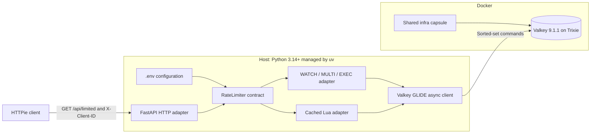
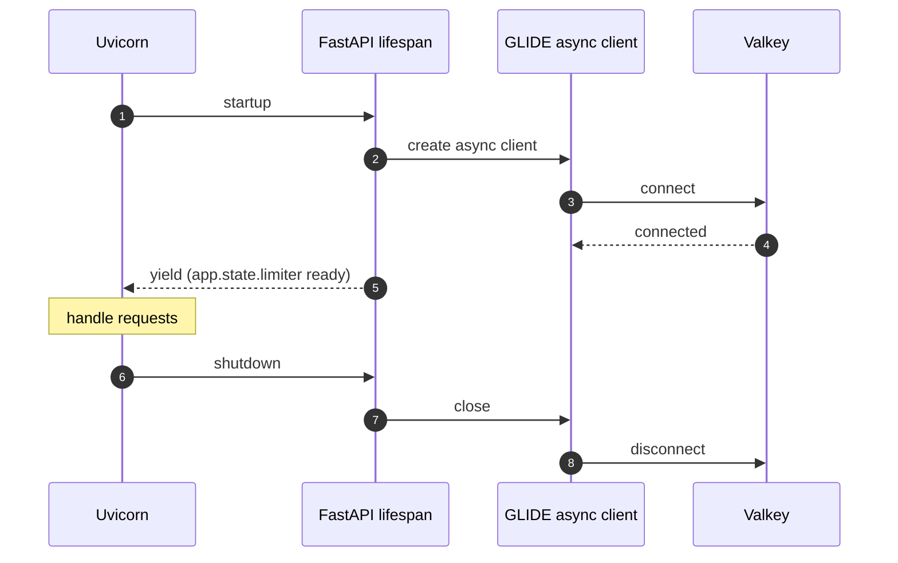
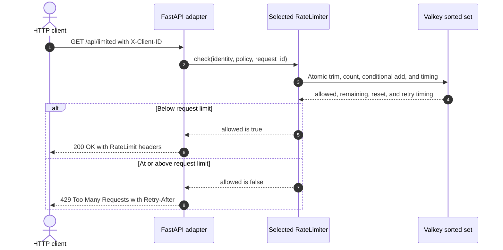

# Sliding-Window Rate Limiter with Python and FastAPI

In this capsule, you limit how many requests one caller can make during the
most recent ten seconds. Valkey stores the time of each accepted request in a
sorted set.

It offers two ways to make the check safe when requests arrive together:

- `multi-exec` uses a Valkey transaction and retries if another writer changes
  the key;
- `lua` runs the complete check as one script inside Valkey.

The default is `multi-exec`. FastAPI creates one asynchronous GLIDE client when
the application starts and closes it when the application stops.

**Level:** [`L300` — Advanced](../../../docs/authoring.md#choose-the-level)

## Start here

You should know Python `async` functions, HTTP status codes, and basic Valkey
commands.

For every request, the limiter:

1. removes request times that are outside the window;
2. counts the request times still inside the window;
3. accepts the request when the count is below the limit;
4. stores the new request time when accepted; and
5. returns HTTP 429 plus a wait time when denied.

Key words:

- **asynchronous:** able to pause while waiting for network work;
- **rate limit:** a rule that allows only a set number of requests;
- **sliding window:** a time range measured backward from right now;
- **sorted set:** Valkey data ordered by numeric scores;
- **atomic:** completed without another request changing the middle of the
  calculation; and
- **lifespan:** FastAPI startup and shutdown code.

A failed `WATCH` gives the transaction a *Groundhog Day* moment: it starts over
because another request changed the key before `EXEC`.

Read the code in this order:

1. [`decision.py`](src/rate_limiter_demo/decision.py) for the result;
2. [`app.py`](src/rate_limiter_demo/app.py) for startup and the HTTP route;
3. [`multi_exec.py`](src/rate_limiter_demo/valkey/multi_exec.py) for the
   transaction; and
4. [`sliding_window.lua`](src/rate_limiter_demo/valkey/scripts/sliding_window.lua)
   for the script version.

## Quick demo

Prerequisites:

- Docker with Compose v2, running locally;
- `make`;
- [uv](https://docs.astral.sh/uv/);
- [HTTPie](https://httpie.io/cli).

On macOS, the included Brewfile also installs optional presentation tools:

```shell
brew bundle
make demo
```

[`example.yaml`](example.yaml) points to the root
[infrastructure capsule](../../../infra/README.md), selecting
`valkey-standalone-host`. The example has no local Compose file.

The demo sends five accepted requests for caller A. Request six returns HTTP
429. Caller B still receives HTTP 200 because each caller has a separate
limit. The demo waits for the `Retry-After` time, tries caller A again, and
then cleans up its own processes.

Run the same journey with the Lua implementation:

```shell
RATE_LIMIT_IMPLEMENTATION=lua make demo
```

Every visible demo request uses HTTPie. Gum highlights accepted requests as
green `✅ 200 Accepted` outcomes and denied requests as red `❌ 429 Denied`
outcomes. The emoji labels remain visible in plain and CI output when Gum
styling is disabled.

## Recording scripts

- [Short reel script](docs/SCRIPT_REEL.md)
- [Longer tutorial-video script](docs/SCRIPT_VIDEO.md)

## Architecture



Only Valkey runs in Docker, supplied by the shared infrastructure capsule. The
FastAPI application and the asynchronous GLIDE client run on the host. The
Valkey image is
`valkey/valkey:9-trixie`, pinned to an immutable multi-platform digest.

## Application lifespan



## Allowed and denied flow



## Configuration

Copy `.env.example` to `.env` and adjust as needed. All settings can also be
passed as environment variables, which take precedence over `.env`.

| Variable | Default | Description |
| --- | --- | --- |
| `RATE_LIMIT_IMPLEMENTATION` | `multi-exec` | `multi-exec` or `lua` |
| `RATE_LIMIT_REQUESTS` | `5` | Maximum requests per window |
| `RATE_LIMIT_WINDOW_MS` | `10000` | Sliding window in milliseconds |
| `RATE_LIMIT_POLICY_ID` | `default` | Policy slug used in Valkey keys |
| `RATE_LIMIT_KEY_PREFIX` | `valkey-examples:rate-limit:v1` | Key namespace |
| `RATE_LIMIT_MAX_RETRIES` | `50` | WATCH retry bound (multi-exec only) |
| `VALKEY_HOST` | `127.0.0.1` | Valkey host |
| `VALKEY_PORT` | `6379` | Valkey port |
| `VALKEY_REQUEST_TIMEOUT_MS` | `1000` | GLIDE request timeout |
| `APP_HOST` | `127.0.0.1` | FastAPI bind host |
| `APP_PORT` | `8000` | FastAPI bind port |

## HTTP contract

### `GET /api/limited`

Requires an `X-Client-ID` header. The raw value is SHA-256 hashed before use
in any Valkey key.

**HTTP 200 — admitted:**

```text
RateLimit-Limit: 5
RateLimit-Remaining: 4
RateLimit-Reset: 10
```

```json
{"allowed": true, "limit": 5, "remaining": 4, "reset_after_ms": 9812}
```

**HTTP 429 — denied:**

```text
RateLimit-Limit: 5
RateLimit-Remaining: 0
RateLimit-Reset: 8
Retry-After: 8
```

```json
{"allowed": false, "limit": 5, "remaining": 0, "reset_after_ms": 7943, "retry_after_ms": 7943}
```

### `GET /health/live` and `GET /health/ready`

`/health/live` always returns HTTP 200. `/health/ready` returns HTTP 503 if
the Valkey connection is not available.

## Security notice

This capsule binds to loopback (`127.0.0.1`) and uses no credentials or TLS.
It is a credential-free local learning journey and is **not** suitable for
production use without network isolation, authentication, TLS, trusted identity
derivation, and abuse controls.

## Capsule interface

```shell
make setup   # install the locked Python environment
make start   # start Valkey and the FastAPI application
make verify  # lint, typecheck, and run all tests
make reset   # delete rate-limit keys from the running Valkey instance
make stop    # stop the application and Valkey
make demo    # end-to-end HTTPie journey with cleanup
```
