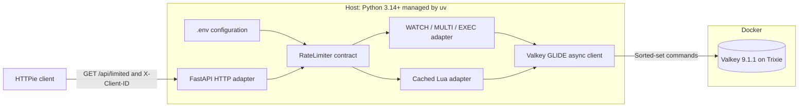
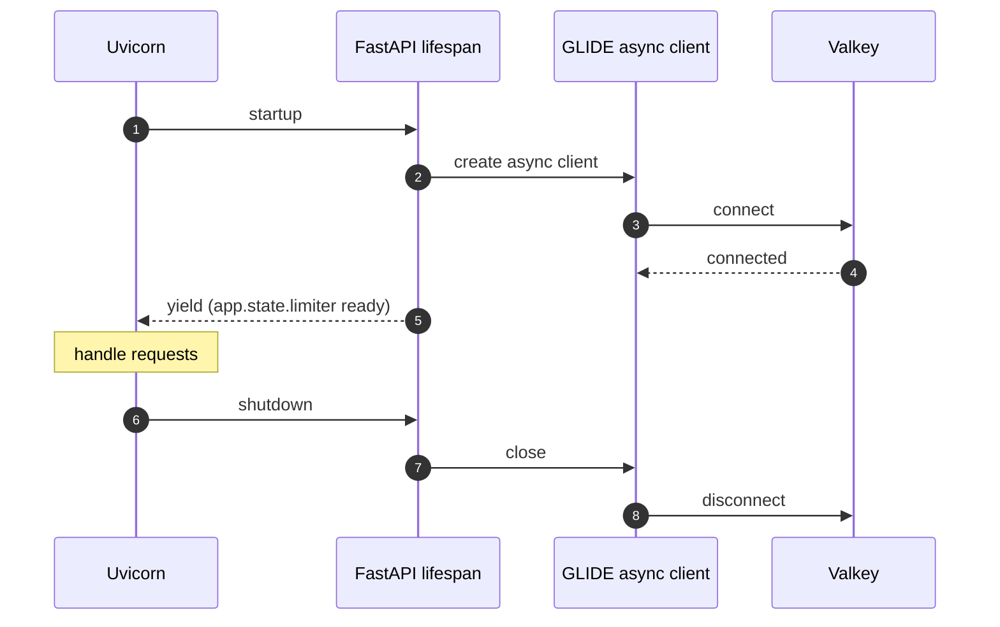
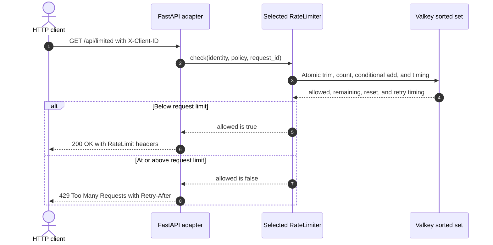

# Sliding-Window Rate Limiter with Python and FastAPI

This capsule demonstrates a true sliding-window log rate limiter backed by a
Valkey sorted set. It includes two interchangeable atomic implementations:

- `multi-exec` uses `WATCH`, a bounded retry loop, and `MULTI`/`EXEC`;
- `lua` uses one cached server-side Lua script.

Both use Valkey server time, store one sorted set per policy and hashed
identity, return the same HTTP contract, and enforce the same cardinality
bound. The default is `multi-exec`.

FastAPI lifespan management owns one asynchronous GLIDE client for the lifetime
of the application. Request handlers do not create per-request connections.

## Quick demo

Prerequisites:

- Docker with Compose v2, running locally;
- `make`;
- [uv](https://docs.astral.sh/uv/);
- [HTTPie](https://httpie.io/cli).

On macOS, the included Brewfile also installs optional presentation tools:

```shell
brew bundle
make demo
```

The demo starts Valkey and the FastAPI application, sends five HTTP 200
requests for identity A, shows its sixth request returning HTTP 429, proves
identity B still receives HTTP 200, waits for the returned `Retry-After`, and
confirms identity A is allowed again. If another valid 429 extends the window,
the demo follows the new `Retry-After` through a bounded polling loop. An exit
trap stops only this capsule's resources.

Run the same journey with the Lua implementation:

```shell
RATE_LIMIT_IMPLEMENTATION=lua make demo
```

Every visible demo request uses HTTPie. Gum highlights accepted requests as
green `✅ 200 Accepted` outcomes and denied requests as red `❌ 429 Denied`
outcomes. The emoji labels remain visible in plain and CI output when Gum
styling is disabled.

## Architecture



Only Valkey runs in Docker. The FastAPI application and the asynchronous GLIDE
client run on the host. The Valkey image is
`valkey/valkey:9-trixie`, pinned to an immutable multi-platform digest.

## Application lifespan



## Allowed and denied flow



## Configuration

Copy `.env.example` to `.env` and adjust as needed. All settings can also be
passed as environment variables, which take precedence over `.env`.

| Variable | Default | Description |
| --- | --- | --- |
| `RATE_LIMIT_IMPLEMENTATION` | `multi-exec` | `multi-exec` or `lua` |
| `RATE_LIMIT_REQUESTS` | `5` | Maximum requests per window |
| `RATE_LIMIT_WINDOW_MS` | `10000` | Sliding window in milliseconds |
| `RATE_LIMIT_POLICY_ID` | `default` | Policy slug used in Valkey keys |
| `RATE_LIMIT_KEY_PREFIX` | `valkey-examples:rate-limit:v1` | Key namespace |
| `RATE_LIMIT_MAX_RETRIES` | `50` | WATCH retry bound (multi-exec only) |
| `VALKEY_HOST` | `127.0.0.1` | Valkey host |
| `VALKEY_PORT` | `6379` | Valkey port |
| `VALKEY_REQUEST_TIMEOUT_MS` | `1000` | GLIDE request timeout |
| `APP_HOST` | `127.0.0.1` | FastAPI bind host |
| `APP_PORT` | `8000` | FastAPI bind port |

## HTTP contract

### `GET /api/limited`

Requires an `X-Client-ID` header. The raw value is SHA-256 hashed before use
in any Valkey key.

**HTTP 200 — admitted:**

```text
RateLimit-Limit: 5
RateLimit-Remaining: 4
RateLimit-Reset: 10
```

```json
{"allowed": true, "limit": 5, "remaining": 4, "reset_after_ms": 9812}
```

**HTTP 429 — denied:**

```text
RateLimit-Limit: 5
RateLimit-Remaining: 0
RateLimit-Reset: 8
Retry-After: 8
```

```json
{"allowed": false, "limit": 5, "remaining": 0, "reset_after_ms": 7943, "retry_after_ms": 7943}
```

### `GET /health/live` and `GET /health/ready`

`/health/live` always returns HTTP 200. `/health/ready` returns HTTP 503 if
the Valkey connection is not available.

## Security notice

This capsule binds to loopback (`127.0.0.1`) and uses no credentials or TLS.
It is a credential-free local learning journey and is **not** suitable for
production use without network isolation, authentication, TLS, trusted identity
derivation, and abuse controls.

## Capsule interface

```shell
make setup   # install the locked Python environment
make start   # start Valkey and the FastAPI application
make verify  # lint, typecheck, and run all tests
make reset   # delete rate-limit keys from the running Valkey instance
make stop    # stop the application and Valkey
make demo    # end-to-end HTTPie journey with cleanup
```
