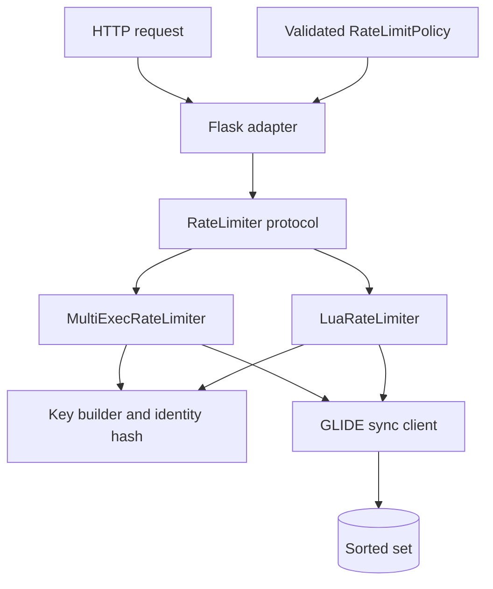
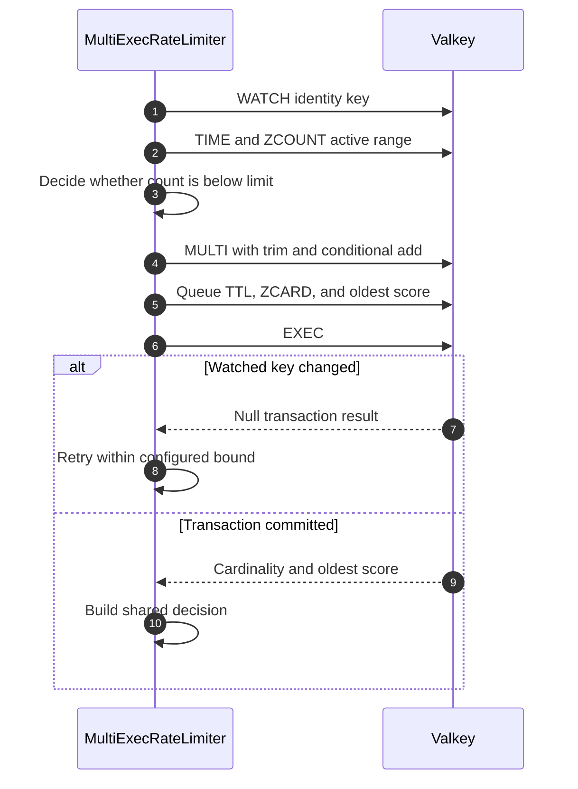
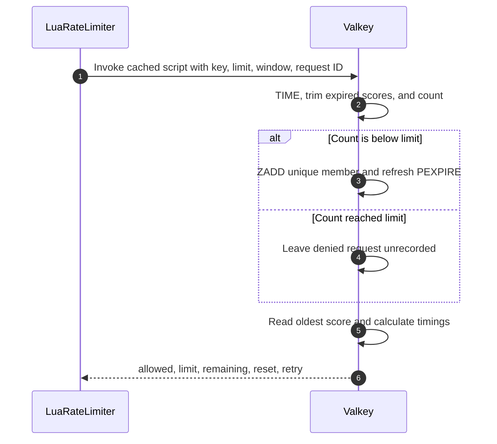

# Design: Sliding-Window Rate Limiter

## Objective

Teach a true sliding-window log using Valkey sorted sets while making two
atomicity techniques directly comparable behind one Python interface.

The implementation uses Python 3.13+, uv, Flask, synchronous Valkey GLIDE, and
Valkey 9.1.1 on the pinned Trixie image. `multi-exec` is the default; `lua` is
selected through an immutable `pydantic-settings` configuration model.

## Components



The Flask layer knows only the shared decision contract. It does not know
sorted-set command order, transaction retries, script return positions, or key
layout.

## Data model

One key exists per policy and caller identity:

```text
<prefix>:<policy-id>:<sha256(identity)>
```

The raw `X-Client-ID` is never placed in a key or demo state display.

Each accepted request becomes one sorted-set member:

```text
member = <server-time-ms>:<random-request-id>
score  = <server-time-ms>
```

The random request ID prevents same-millisecond requests from overwriting each
other. Denied requests are not inserted. The key TTL is refreshed only after
an accepted request, so inactive identities disappear without a cleanup job.

## Decision semantics

For server time `now`, window `W`, and limit `L`:

1. remove scores less than or equal to `now - W`;
2. count active members;
3. accept only when the count is less than `L`;
4. on acceptance, add the unique member and set a `W` millisecond TTL;
5. read the oldest active score;
6. calculate remaining capacity and reset or retry timing.

An event exactly on the lower boundary is expired. The represented interval is
`(now - W, now]`.

## Multi-exec implementation



`WATCH` closes the race between the pre-transaction count and the write. A
process-local lock is also required because `WATCH` state belongs to the GLIDE
connection. Independent clients still contend correctly through Valkey.

After `RATE_LIMIT_MAX_RETRIES` conflicts, the adapter fails closed instead of
over-admitting.

## Lua implementation



Valkey executes the script atomically. GLIDE retains the `Script` object so the
client can use its cached SHA and recover when the server does not yet have the
script loaded.

## HTTP and failure contract

`GET /api/limited` requires `X-Client-ID`. Responses contain `allowed`,
`limit`, `remaining`, and `reset_after_ms`; a denial also contains
`retry_after_ms`. Headers include `RateLimit-Limit`, `RateLimit-Remaining`,
`RateLimit-Reset`, and, for HTTP 429, `Retry-After`.

The API fails closed:

- invalid identity: HTTP 400;
- no trustworthy Valkey decision: HTTP 503;
- limit reached: HTTP 429;
- admitted: HTTP 200.

## Verification strategy

Unit tests cover configuration, identity hashing, decision formatting, key
construction, script-result validation, and the Flask adapter.

The real-Valkey suite runs the same contract against both adapters. It verifies
limits, identity isolation, TTLs, expiry, and HTTP behavior. Concurrency tests
use several independent GLIDE clients and assert that accepted requests and
final sorted-set cardinality never exceed the policy limit.

The interactive `make demo` uses two identities to make isolation observable,
follows repeated HTTP 429 `Retry-After` values through a bounded recovery loop,
and `make demo-record` captures that command rather than duplicating the
scenario in VHS.
