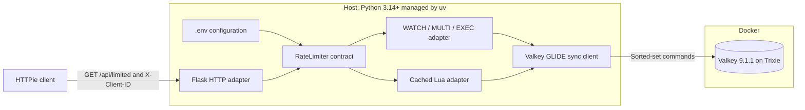
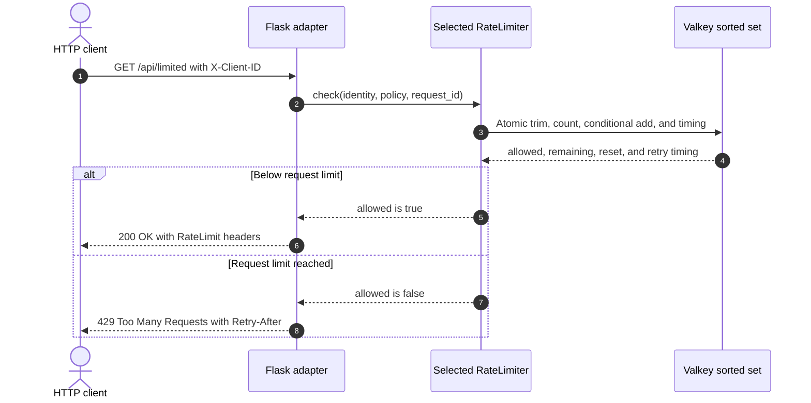

# Sliding-Window Rate Limiter with Python and Flask

This capsule demonstrates a true sliding-window log rate limiter backed by a
Valkey sorted set. It includes two interchangeable atomic implementations:

- `multi-exec` uses `WATCH`, a bounded retry loop, and `MULTI`/`EXEC`;
- `lua` uses one cached server-side Lua script.

Both use Valkey server time, store one sorted set per policy and hashed
identity, return the same HTTP contract, and enforce the same cardinality
bound. The default is `multi-exec`.

## Quick demo

Prerequisites:

- Docker with Compose v2, running locally;
- `make`;
- [uv](https://docs.astral.sh/uv/);
- [HTTPie](https://httpie.io/cli).

On macOS, the included Brewfile also installs optional presentation and
recording tools:

```shell
brew bundle
make demo
```

The demo starts Valkey and Flask, sends five HTTP 200 requests for identity A,
shows its sixth request returning HTTP 429, proves identity B still receives
HTTP 200, waits for the returned `Retry-After`, and confirms identity A is
allowed again. If another valid 429 extends the window, the demo follows the
new `Retry-After` through a bounded polling loop. An exit trap stops only this
capsule's resources.

Run the same journey with the Lua implementation:

```shell
RATE_LIMIT_IMPLEMENTATION=lua make demo
```

Every visible demo request uses HTTPie. There is no curl fallback.
Gum highlights accepted requests as green `✅ 200 Accepted` outcomes and denied
requests as red `❌ 429 Denied` outcomes. The emoji labels remain visible in
plain and CI output when Gum styling is disabled.

## Architecture



Only Valkey runs in Docker. Flask runs on the host because the GLIDE Python
package does not support musl-based Alpine environments. The Valkey image is
therefore `valkey/valkey:9-trixie`, pinned to an immutable multi-platform
digest.

## Allowed and denied flow



## Configuration

Copy the committed defaults only when you want a local override:

```shell
cp .env.example .env
```

`make start` and `make demo` load the ignored `.env` file.

| Setting | Default | Configures |
| --- | --- | --- |
| `RATE_LIMIT_IMPLEMENTATION` | `multi-exec` | Atomic backend: `multi-exec` or `lua` |
| `RATE_LIMIT_REQUESTS` | `5` | Maximum accepted requests in one rolling window |
| `RATE_LIMIT_WINDOW_MS` | `10000` | Rolling-window length |
| `RATE_LIMIT_POLICY_ID` | `default` | Policy segment in the Valkey key |
| `RATE_LIMIT_KEY_PREFIX` | `valkey-examples:rate-limit:v1` | Capsule namespace |
| `RATE_LIMIT_MAX_RETRIES` | `50` | Transaction retries after `WATCH` conflicts |
| `VALKEY_HOST` | `127.0.0.1` | GLIDE connection host |
| `VALKEY_PORT` | `6379` | GLIDE and Docker-published port |
| `VALKEY_REQUEST_TIMEOUT_MS` | `1000` | Per-request GLIDE timeout |
| `FLASK_HOST` | `127.0.0.1` | Flask bind address |
| `FLASK_PORT` | `8000` | Flask bind port |

Policy values are validated by the immutable `pydantic-settings` model in
`src/rate_limiter_demo/config.py`, assembled into a `RateLimitPolicy` in
`app.py`, and supplied to the selected adapter for every request.

## Manual use

```shell
make setup
make start

http GET :8000/api/limited X-Client-ID:my-demo-user

make reset
make stop
```

The endpoint returns HTTP 200 while below the limit, HTTP 429 with
`Retry-After` at the limit, HTTP 400 for an invalid identity, and HTTP 503 when
Valkey cannot produce a trustworthy decision. Health endpoints are
`/health/live` and `/health/ready`.

## Standard targets

```shell
make setup
make start
make verify
make reset
make stop
```

`make verify` runs formatting, linting, strict type checks, unit tests, the
shared contract suite against both implementations, concurrency tests using
multiple GLIDE clients, and the HTTP journey against real Valkey.

Record the demo locally with:

```shell
make demo-record
```

The ignored output is `.artifacts/sliding-window-rate-limiter.mp4`.

## Security and scope

This is an educational example, not a production-certified gateway. It hashes
the demonstration identity before using it in a key, bounds identity and
configuration sizes, does not trust forwarding headers, and uses no
credentials. Production systems still need authentication, TLS, ACLs,
availability design, monitoring, policy administration, and an explicit
identity trust boundary.

See [DESIGN.md](DESIGN.md) for the algorithm, concurrency guarantees, data
model, and failure behavior.
