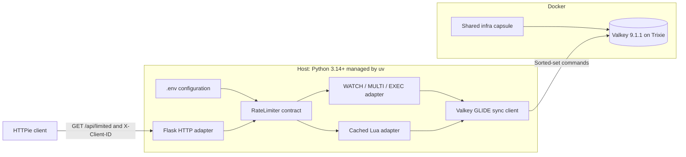
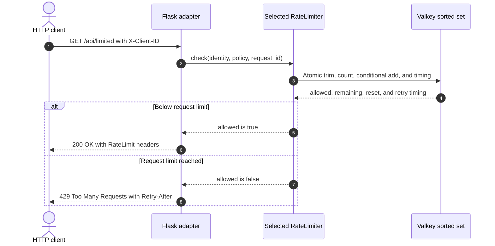

# Sliding-Window Rate Limiter with Python and Flask

In this capsule, you limit how many requests one caller can make during the
most recent ten seconds. Valkey stores the time of each accepted request in a
sorted set.

It offers two ways to make the check safe when requests arrive together:

- `multi-exec` uses a Valkey transaction and retries if another writer changes
  the key;
- `lua` runs the complete check as one script inside Valkey.

The default is `multi-exec`.

**Level:** [`L300` — Advanced](../../../docs/authoring.md#choose-the-level)

## Start here

You should know Python functions, HTTP status codes, and basic Valkey commands.

For every request, the limiter:

1. removes request times that are outside the window;
2. counts the request times still inside the window;
3. accepts the request when the count is below the limit;
4. stores the new request time when accepted; and
5. returns HTTP 429 plus a wait time when denied.

Key words:

- **rate limit:** a rule that allows only a set number of requests;
- **sliding window:** a time range measured backward from right now;
- **sorted set:** Valkey data ordered by numeric scores;
- **atomic:** completed as one protected operation, without another request
  changing the middle of the calculation; and
- **transaction:** a group of commands that Valkey attempts together.

A failed `WATCH` gives the transaction a *Groundhog Day* moment: it starts over
because another request changed the key before `EXEC`.

Read the code in this order:

1. [`decision.py`](src/rate_limiter_demo/decision.py) for the result;
2. [`app.py`](src/rate_limiter_demo/app.py) for the HTTP route;
3. [`multi_exec.py`](src/rate_limiter_demo/valkey/multi_exec.py) for the
   transaction; and
4. [`sliding_window.lua`](src/rate_limiter_demo/valkey/scripts/sliding_window.lua)
   for the script version.

## Quick demo

Prerequisites:

- Docker with Compose v2, running locally;
- `make`;
- [uv](https://docs.astral.sh/uv/);
- [HTTPie](https://httpie.io/cli).

On macOS, the included Brewfile also installs optional presentation and
recording tools:

```shell
brew bundle
make demo
```

[`example.yaml`](example.yaml) points to the root
[infrastructure capsule](../../../infra/README.md), selecting
`valkey-standalone-host`. The example has no local Compose file.

The demo sends five accepted requests for caller A. Request six returns HTTP
429. Caller B still receives HTTP 200 because each caller has a separate
limit. The demo waits for the `Retry-After` time, tries caller A again, and
then cleans up its own processes.

Run the same journey with the Lua implementation:

```shell
RATE_LIMIT_IMPLEMENTATION=lua make demo
```

Every visible demo request uses HTTPie. There is no curl fallback.
Gum highlights accepted requests as green `✅ 200 Accepted` outcomes and denied
requests as red `❌ 429 Denied` outcomes. The emoji labels remain visible in
plain and CI output when Gum styling is disabled.

## Recording scripts

- [Short reel script](docs/SCRIPT_REEL.md)
- [Longer tutorial-video script](docs/SCRIPT_VIDEO.md)

## Architecture



Only Valkey runs in Docker, supplied by the shared infrastructure capsule.
Flask runs on the host because the GLIDE Python package does not support
musl-based Alpine environments. The Valkey image is therefore
`valkey/valkey:9-trixie`, pinned to an immutable multi-platform digest.

## Allowed and denied flow



## Configuration

Copy the committed defaults only when you want a local override:

```shell
cp .env.example .env
```

`make start` and `make demo` load the ignored `.env` file.

| Setting | Default | Configures |
| --- | --- | --- |
| `RATE_LIMIT_IMPLEMENTATION` | `multi-exec` | Atomic backend: `multi-exec` or `lua` |
| `RATE_LIMIT_REQUESTS` | `5` | Maximum accepted requests in one rolling window |
| `RATE_LIMIT_WINDOW_MS` | `10000` | Rolling-window length |
| `RATE_LIMIT_POLICY_ID` | `default` | Policy segment in the Valkey key |
| `RATE_LIMIT_KEY_PREFIX` | `valkey-examples:rate-limit:v1` | Capsule namespace |
| `RATE_LIMIT_MAX_RETRIES` | `50` | Transaction retries after `WATCH` conflicts |
| `VALKEY_HOST` | `127.0.0.1` | GLIDE connection host |
| `VALKEY_PORT` | `6379` | GLIDE and Docker-published port |
| `VALKEY_REQUEST_TIMEOUT_MS` | `1000` | Per-request GLIDE timeout |
| `FLASK_HOST` | `127.0.0.1` | Flask bind address |
| `FLASK_PORT` | `8000` | Flask bind port |

`src/rate_limiter_demo/config.py` checks the policy settings.
`app.py` uses them to create a `RateLimitPolicy`. Each request sends that
policy to the selected limiter.

## Manual use

```shell
make setup
make start

http GET :8000/api/limited X-Client-ID:my-demo-user

make reset
make stop
```

The endpoint returns HTTP 200 while below the limit. It returns HTTP 429 with
`Retry-After` at the limit. Invalid identities return HTTP 400. A failed
Valkey check returns HTTP 503.

Health endpoints are `/health/live` and `/health/ready`.

## Standard targets

```shell
make setup
make start
make verify
make reset
make stop
```

`make verify` runs formatting, linting, strict type checks, and unit tests. It
also tests both implementations, concurrent requests, and the HTTP journey
against real Valkey.

Record the demo locally with:

```shell
make demo-record
```

The ignored output is `.artifacts/sliding-window-rate-limiter.mp4`.

## Security and scope

This is an educational example, not a production-certified gateway. It hashes
the demonstration identity before using it in a key, bounds identity and
configuration sizes, does not trust forwarding headers, and uses no
credentials. Production systems still need authentication, TLS, ACLs,
availability design, monitoring, policy administration, and an explicit
identity trust boundary.

See [DESIGN.md](DESIGN.md) for the algorithm, concurrency guarantees, data
model, and failure behavior.
