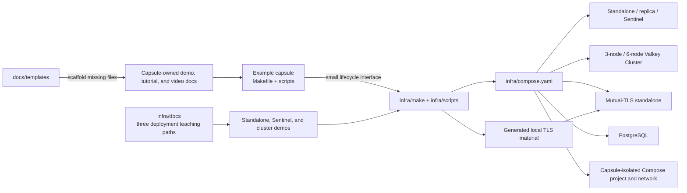

# Shared Infrastructure Capsule

This capsule owns the local database processes used by every runnable example.
Example capsules keep their application code, dependencies, tests, and
application-only Compose services, then declare which infrastructure profiles
they use in `example.yaml`.

## Start here

You need basic command-line and Docker knowledge. You do not need to know how
Valkey replication or clustering works before starting.

Key words:

- **container:** an isolated process started by Docker;
- **profile:** the named group of containers selected by `PROFILE=...`;
- **primary:** a Valkey node that accepts writes;
- **replica:** a node that copies data from a primary;
- **Sentinel:** processes that watch a primary and choose a replacement; and
- **cluster:** several Valkey nodes that split keys into groups called slots.

Cluster slots work like the Hogwarts Sorting Hat: Valkey assigns each key to
one shard. Unlike the hat, Valkey uses a repeatable calculation, so the same
key receives the same slot.

Start with one path:

```shell
make start PROFILE=valkey-standalone
make demo-standalone
make stop
```

Then read the
[standalone tutorial](docs/standalone/TUTORIAL.md). Move to Sentinel and
cluster only after the one-node example makes sense.

Read the files in this order:

1. [`compose.yaml`](compose.yaml) to see which containers belong to each
   profile;
2. [`valkey/valkey.conf`](valkey/valkey.conf) to see the shared server
   settings;
3. [`scripts/validate-valkey.sh`](scripts/validate-valkey.sh) to see the
   `PING`, `SET`, `GET`, and `INFO` checks; and
4. [`scripts/capsule.sh`](scripts/capsule.sh) only when you need the shared
   startup and cleanup details.

The stable interface is:

```shell
make setup
make start PROFILE=valkey-standalone-host
make validate-plaintext
make validate-tls
make demo-standalone
make demo-sentinel
make demo-cluster
make verify
make test-real
make reset
make stop
```

Each example uses the shared files under `make/` and `scripts/`. Those files
provide the same startup, readiness, and cleanup behavior to every capsule.

## Deployment demos and tutorials

[`docs/`](docs/README.md) teaches the three principal Valkey deployment
shapes exposed by this capsule:

- standalone;
- Sentinel-managed replication; and
- Valkey Cluster.

Each has a separate demo runbook, tutorial, reel script, and tutorial-video
script. One shared [`docs/DESIGN.md`](docs/DESIGN.md) explains the common
configuration, lifecycle, architecture, and supporting profile variants.

Run a teaching path from this directory:

```shell
make start PROFILE=valkey-standalone
make demo-standalone
make stop
```

Every deployment demo confirms that its container is running. It runs `PING`,
performs one `SET` and `GET`, and displays selected `INFO` output.

The Sentinel demo stops its original primary and proves promotion, so recreate
that profile before each take.

## Example documentation templates

Repository-wide runbook, tutorial, script, and video templates live under
[`../docs/templates/`](../docs/templates/). This capsule provides the shared
documentation scaffolding command:

Scaffold only missing files from the repository root:

```shell
make -C infra docs-init \
  CAPSULE=examples/operations/client-connection-glide-python
```

The generated files become capsule-owned documentation, and existing files are
preserved.

## Profiles

| Profile | Infrastructure |
| --- | --- |
| `valkey-standalone` | One private Valkey node |
| `valkey-standalone-replicated` | One primary and one replica |
| `valkey-sentinel` | One primary, one replica, and three Sentinel nodes |
| `valkey-cluster-3` | Three primary cluster nodes |
| `valkey-cluster-6` | Three primary shards with one replica each |
| `valkey-standalone-host` | One Valkey node published to loopback |
| `valkey-standalone-tls-host` | One mutual-TLS Valkey node published to loopback |
| `postgres` | One PostgreSQL node published to loopback |

The Valkey image defaults to the repository's pinned Alpine image. A capsule
can select another immutable Valkey image through `VALKEY_IMAGE`; the
rate-limiter examples use the pinned Trixie image recorded in their manifests.

PostgreSQL is available for future capsules but is not currently selected by
any example.

## Shared Valkey configuration

Every Valkey data node loads [`valkey/valkey.conf`](valkey/valkey.conf).
Role-specific settings such as replication and cluster membership stay in
Compose. The shared file configures common runtime behavior once:

| Setting | Shared default | Rationale |
| --- | --- | --- |
| `io-threads` | `2` | Exercise threaded socket I/O without creating a large local thread pool |
| `maxmemory` | `256mb` | Bound each educational node's keyspace memory |
| `maxmemory-policy` | `noeviction` | Preserve correctness for examples that are not caches |
| `maxmemory-samples` | `5` | Use Valkey's balanced sampling default |
| lazy freeing | enabled | Keep deletion, expiry, flush, and replica cleanup asynchronous |

These are deterministic educational defaults, not workload-specific
production recommendations. A future cache-specific profile can select an
evicting policy without changing the behavior of storage, rate-limiter, or
topology examples.

## Mutual TLS

`valkey-standalone-tls-host` disables plaintext, publishes TLS on loopback port
`6380`, and requires a valid client certificate. Its overlay is
[`valkey/valkey-tls.conf`](valkey/valkey-tls.conf).

Generate an ignored local CA plus server and client certificates, start the
profile, verify it, and clean up:

```shell
make start PROFILE=valkey-standalone-tls-host
make validate-tls
make stop
make tls-clean
```

Compare it with the plaintext host profile:

```shell
make start PROFILE=valkey-standalone-host
make validate-plaintext
make stop
```

Both validation targets confirm that the container is running. They execute
`PING`, `SET`, `GET`, and selected `INFO` queries. The TLS target authenticates
every command with the generated client certificate.

The generated keys and certificates live under `infra/.cache/tls/`; no private
key is committed. The server certificate is valid for `valkey-tls`,
`localhost`, and `127.0.0.1`.

Run `make test-real` to test plaintext, TLS, shared tuning, and all three
deployment demos. It also confirms that TLS rejects a client without a
certificate and that cleanup removes the Compose resources.

## Architecture



Every caller gets a distinct Compose project name derived from its capsule ID.
`make stop` therefore removes only that capsule's containers, network, and
ephemeral data.
