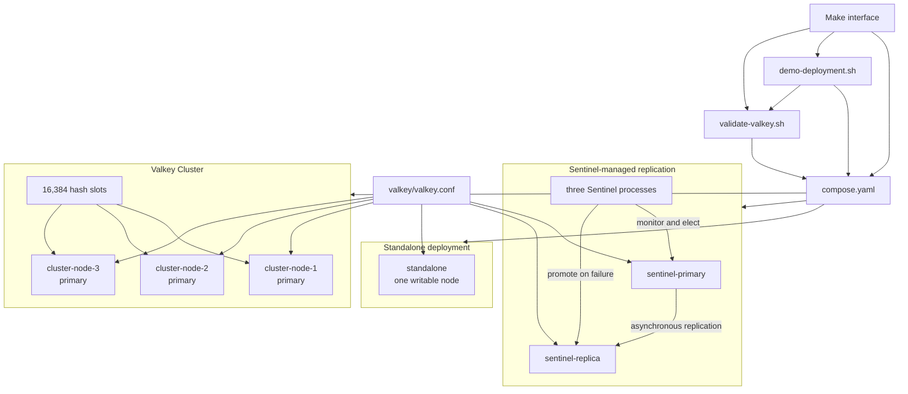

# Shared Valkey Deployment Design

## Purpose

The infrastructure capsule provides repeatable local Valkey deployments behind
a small Make interface. Its documentation teaches three materially different
runtime shapes:

1. one standalone data node;
2. a replicated primary selected and monitored by Sentinel; and
3. a sharded Valkey Cluster.

The demos use the same image, shared configuration, isolated Compose network,
and bounded cleanup. The topology-specific behavior remains visible so a
learner can see what changes between deployments.

## Plain-language map

The infrastructure capsule starts database containers for the examples:

```text
standalone -> one Valkey node
Sentinel   -> one primary, one replica, and three watchers
cluster    -> three primary nodes that split the keys
```

The Make commands choose one of these groups, wait for it to become ready, and
clean up only the containers created for that capsule.

## Stable interface

From the `infra/` directory:

```shell
make start PROFILE=valkey-standalone
make demo-standalone

make start PROFILE=valkey-sentinel
make demo-sentinel

make start PROFILE=valkey-cluster-3
make demo-cluster

make start PROFILE=valkey-standalone-host
make validate-plaintext

make start PROFILE=valkey-standalone-tls-host
make validate-tls

make reset
make stop
```

`PROFILE` is a Make variable that selects the Docker Compose profile to start.
The `make start` target passes its value to:

```shell
docker compose --profile "$PROFILE" up -d --wait
```

Use `valkey-standalone`, `valkey-sentinel`, or `valkey-cluster-3` for the three
teaching paths in this document. If `PROFILE` is omitted, the infrastructure
Makefile defaults to `valkey-standalone-host`, which publishes one Valkey node
to a loopback host port for application capsules.

Only the demo target matching the running profile should be invoked. The demo
script hides repeated Compose invocation details, but it prints the deployment
facts that form the teaching outcome.

`validate-plaintext` and `validate-tls` are transport-validation targets for
the two host-published standalone profiles. Both confirm that the expected
container is running, then execute `PING`, `SET`, `GET`, `INFO server`,
`INFO memory`, and `INFO replication`. The TLS target supplies the generated
CA, client certificate, and client key to every Valkey command.

## Architecture



The external seam is the Make interface. Compose, command selection, service
names, polling, and output parsing remain implementation details of the
infrastructure capsule.

## Teaching profiles

| Teaching path | Compose profile | Observable proof |
| --- | --- | --- |
| Standalone | `valkey-standalone` | Running container, PING, key round trip, INFO, and one writable node |
| Sentinel | `valkey-sentinel` | Initial validation plus discovery, replication, promotion, and recovered read |
| Cluster | `valkey-cluster-3` | Initial validation plus three primaries covering all 16,384 slots |

These profiles do not publish Valkey ports to the host. Demo commands execute
`valkey-cli` inside the private Compose network.

## Supporting profiles

The capsule exposes additional profiles for application tests and variations:

| Profile | Relationship to the teaching paths |
| --- | --- |
| `valkey-standalone-host` | Standalone with a loopback host port; validate with `make validate-plaintext` |
| `valkey-standalone-tls-host` | Mutual-TLS standalone on loopback; validate with `make validate-tls` |
| `valkey-standalone-replicated` | Primary and replica without Sentinel election |
| `valkey-cluster-6` | Three primary shards with one replica each |
| `postgres` | Optional non-Valkey dependency for future example capsules |

They reuse the same lifecycle and configuration but do not add more top-level
deployment tutorials. TLS changes transport security, the raw replicated pair
removes automated discovery, and the six-node cluster adds redundancy to the
same sharding model.

## Shared configuration

Every plaintext data node loads
[`../valkey/valkey.conf`](../valkey/valkey.conf). It centralizes settings that
should be identical across the three deployment shapes:

- `maxmemory 256mb` bounds local memory;
- `maxmemory-policy noeviction` avoids silent educational data loss;
- `io-threads 2` exercises threaded socket I/O;
- persistence is disabled because demo data is disposable; and
- lazy freeing keeps cleanup asynchronous.

Replication and cluster membership stay in
[`../compose.yaml`](../compose.yaml), because they define a node's role rather
than a common runtime default. Sentinel behavior stays in
[`../sentinel/sentinel.conf`](../sentinel/sentinel.conf).

## Demo behavior

[`../scripts/validate-valkey.sh`](../scripts/validate-valkey.sh) is the shared
validation module. For plaintext, TLS, standalone, Sentinel, or cluster mode,
it:

```text
confirm the expected container is running
PING
SET one deterministic namespaced key
GET and compare the stored value
display selected INFO server, memory, and replication fields
```

[`../scripts/demo-deployment.sh`](../scripts/demo-deployment.sh) reuses that
module, then adds the topology-specific proof:

```text
standalone -> shared validation
sentinel   -> shared validation -> WAIT -> stop primary -> promote -> INFO and GET
cluster    -> shared validation with routing -> cluster state and slot coverage
```

The script validates that the required services are running before it changes
state. The Sentinel path requires a fresh start because it deliberately stops
the original primary.

## Isolation and cleanup

Compose project names isolate callers. Valkey data directories use `tmpfs`, so
`make stop` removes processes and networks and `make reset` also removes any
ephemeral volumes owned by the project.

Demo keys use the `valkey-examples:infra:` prefix. The cluster key includes the
`{demo}` hash tag to make its slot identity easy to discuss.

## Security and production boundary

The private teaching profiles use no authentication, disable protected mode,
and trust their isolated Compose network. They must not be published or copied
as production security defaults.

The mutual-TLS standalone profile demonstrates encrypted, client-authenticated
transport separately. Production deployments also require authorization,
durable persistence, backups, capacity planning, monitoring, failure-domain
placement, and topology-specific operational procedures.
